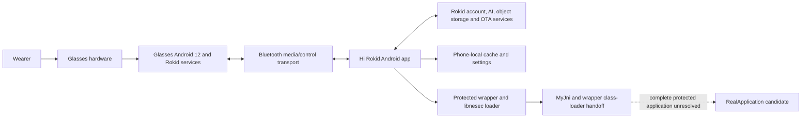
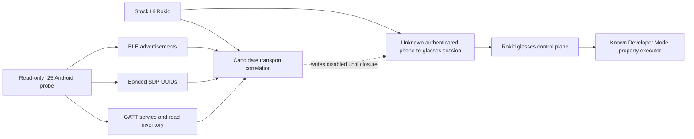
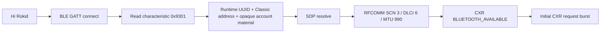

# Rokid AI Glasses Style Architecture

This is the short architecture entry point. The detailed, evidence-labeled
architecture is maintained in
[`docs/architecture/non-display-system-architecture.md`](docs/architecture/non-display-system-architecture.md).

## System layers

## Proven boundaries

- The glasses are a complete Android device with privileged Rokid services.
- The phone is the observed cloud gateway for the tested voice and visual AI
  paths.
- Hi Rokid handles binding, model selection, AI WebSockets, visual uploads,
  firmware checks, background services, and retained conversation state.
- The protected wrapper/native-loader boundary and exact 11-method `MyJni`
  registration contract are documented.
- The r24.1 review recovered eight logical DEX call sites for seven `MyJni`
  methods but did not prove business-feature semantics.

## Unresolved implementation boundary

The repository does not yet contain an independent Android companion that can
bind, authenticate, establish the stock command channel, read glasses state, or
change Developer Mode. The glasses-side Developer Mode property changes are
known statically; the remote invocation path is not.

See:

- [Current project status](docs/project-status.md)
- [Detailed architecture](docs/architecture/non-display-system-architecture.md)
- [Test and research matrix](docs/tests/test-matrix.md)
- [Protected-application review](docs/research/protected-application/README.md)

<!-- BEGIN R1.3.3.2.25 STOCK CHANNEL ARCHITECTURE -->
## r25 implementation boundary

The read-only probe is not a replacement companion yet. It establishes transport visibility while keeping proprietary writes disabled.
<!-- END R1.3.3.2.25 STOCK CHANNEL ARCHITECTURE -->
<!-- BEGIN R1.3.3.2.25.1 STOCK SESSION ARCHITECTURE -->
## r25.1 observed stock session architecture

The runtime endpoint is provisioned; cached UUID inventory alone is not sufficient to open the stock channel.
<!-- END R1.3.3.2.25.1 STOCK SESSION ARCHITECTURE -->

## r25.2 independent bootstrap boundary

The minimal client now implements the BLE `0x9100/0x9301` provisioning boundary and a connection-only RFCOMM lifecycle. Runtime endpoint values remain private and in-memory; CXR framing and Developer Mode remain outside this release.
