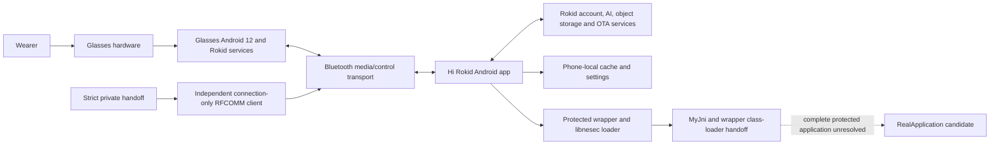
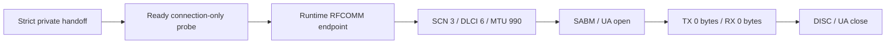
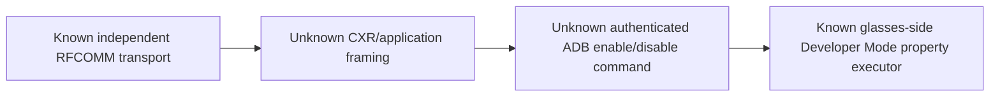

# Rokid AI Glasses Style Architecture

This is the short architecture entry point. The detailed, evidence-labeled
architecture is maintained in
[`docs/architecture/non-display-system-architecture.md`](docs/architecture/non-display-system-architecture.md).

## System layers

## Proven boundaries

- The glasses are a complete Android device with privileged Rokid services.
- The phone is the observed cloud gateway for the tested voice and visual AI
  paths.
- Hi Rokid handles binding, model selection, AI WebSockets, visual uploads,
  firmware checks, background services, and retained conversation state.
- The protected wrapper/native-loader boundary and exact 11-method `MyJni`
  registration contract are documented.
- The r24.1 review recovered eight logical DEX call sites for seven `MyJni`
  methods but did not prove business-feature semantics.
- The r25.2.4 result proves an independent Android client-side RFCOMM
  connection-only lifecycle with SCN `3`, DLCI `6`, MTU `990`, matching
  open/close, and zero application bytes in both directions by HCI census.

## Proven connection-only transport

The private handoff is validated before the measured interval, exactly one
connection request is accepted, the bugreport is collected after close, and the
handoff is revoked afterward. Dynamic endpoint, process, slot, and handle values
remain private.

## Current application boundary

The repository now contains an independent **transport client**, not a complete
replacement companion. Application framing, authentication/integrity fields,
request/reply semantics, the stock ADB enable/disable payloads, and a safe
independent toggle remain unresolved.

## Replacement-app readiness

| Layer | Current status |
|---|---|
| Runtime endpoint attribution | Complete in accepted r25.2 scope |
| RFCOMM service/channel identity | Complete: SCN 3, DLCI 6, MTU 990 |
| Connection-only Android client | Implemented and device-qualified |
| Same-attempt transport lifecycle | Proven |
| HCI zero-payload census | Proven: TX 0 bytes, RX 0 bytes |
| Binding/session authentication | General independent reproduction unresolved |
| CXR/application framing | Unresolved |
| ADB command/reply semantics | Unresolved |
| Guarded independent Developer Mode toggle | Not implemented |

## Read next

- [Current project status](docs/project-status.md)
- [Detailed architecture](docs/architecture/non-display-system-architecture.md)
- [Connection-protocol index](docs/research/connection-protocol/README.md)
- [Final RFCOMM closure](docs/research/connection-protocol/r1.3.3.2.25.2.4-final-rfcomm-client-zero-payload-closure.md)
- [Runtime status](docs/research/connection-protocol/r1.3.3.2.25.2.4-runtime-status-summary.json)
- [Android client](android-client/README.md)
- [Test and research matrix](docs/tests/test-matrix.md)
