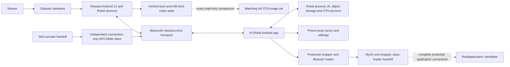
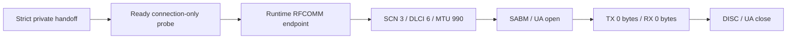
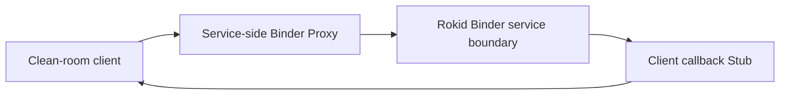
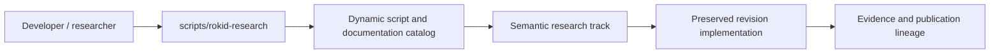
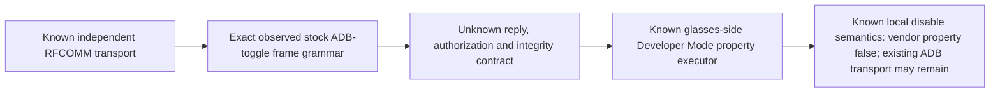

# Rokid AI Glasses Style Architecture

This is the short architecture entry point. The detailed, evidence-labeled
architecture is maintained in
[`docs/architecture/non-display-system-architecture.md`](docs/architecture/non-display-system-architecture.md).

## System layers

## Proven boundaries

- The glasses are a complete Android device with privileged Rokid services.
- The phone is the observed cloud gateway for the tested voice and visual AI
  paths.
- Hi Rokid handles binding, model selection, AI WebSockets, visual uploads,
  firmware checks, background services, and retained conversation state.
- The protected wrapper/native-loader boundary and exact 11-method `MyJni`
  registration contract are documented.
- The r24.1 review recovered eight logical DEX call sites for seven `MyJni`
  methods but did not prove business-feature semantics.
- The r25.2.4 result proves an independent Android client-side RFCOMM
  connection-only lifecycle with SCN `3`, DLCI `6`, MTU `990`, matching
  open/close, and zero application bytes in both directions by HCI census.
- The accepted repaired stock-toggle capture proves two disable and two enable
  semantic transitions, a usable control channel, final-state restoration,
  target DLCI 6 UIH attribution, and an exact observed outbound message grammar.
  No custom transmission or captured-payload replay was attempted.
- The live bootloader-reported 11,904-byte vbmeta chain matches the exact
  OTA-derived chain. Regular ADB shell access cannot read or write the active
  boot-chain partitions.
- One repaired Magisk 30.7 boot candidate is accepted offline with the pristine
  Rokid kernel and `PREINITDEVICE=metadata`; it has not been booted or flashed.

## Proven connection-only transport

The private handoff is validated before the measured interval, exactly one
connection request is accepted, the bugreport is collected after close, and the
handoff is revoked afterward. Dynamic endpoint, process, slot, and handle values
remain private.

## Test 21 static CXR-L Binder boundary

Test 21 closes the **static** Binder interface boundary for the accepted `com.rokid.cxr:client-l:1.0.1` artifact. The callback side is complete at 7/7 interfaces, 21/21 methods, 21/21 Stub ↔ Proxy confirmations, and 0 transaction mismatches. The service/client prerequisite was accepted in r3.3.4.2.6.1.1. This does not prove authorization, session lifecycle, proprietary service implementation, or end-to-end functional compatibility.

See [Test 21 static Binder boundary](docs/research/cxr/test21-static-binder-boundary-overview.md) and the [callback transaction reference](docs/research/cxr/test21-callback-transaction-reference.md).

<!-- r27.1.0-canonical-tooling -->
## Research tooling architecture

R27.1 separates the stable developer interface from historical revision filenames. The initial canonical layer inventories and resolves the existing implementations without deleting or automatically executing them. Later migrations may extract shared modules only after equivalence tests preserve accepted results and evidence lineage. By R27.1.12, validators, packagers, and active Test 21 source-contract implementations have converged on canonical engines, while independent tool-test suites are explicitly retained as regression oracles rather than collapsed into the implementations they verify.

See [canonical research tooling](docs/research/tooling/README.md).

## Current application boundary

The repository contains an independent **connection-only transport client** and
a host-only decoder for the observed stock ADB-toggle message family. It does
not contain a sender. Reply semantics, authorization/integrity fields, broader
protocol generalization, independent sequence-field code correlation, and a
safe rollback-capable toggle remain unresolved.

## Replacement-app readiness

| Layer | Current status |
|---|---|
| Runtime endpoint attribution | Complete in accepted r25.2 scope |
| RFCOMM service/channel identity | Complete: SCN 3, DLCI 6, MTU 990 |
| Connection-only Android client | Implemented and device-qualified |
| Same-attempt transport lifecycle | Proven |
| HCI zero-payload census | Proven: TX 0 bytes, RX 0 bytes |
| Binding/session authentication | General independent reproduction unresolved |
| Observed stock ADB-toggle frame grammar | Closed for four qualified messages; broader CXR protocol unresolved |
| Stock local disable/restore semantics | Proven; transport loss is not a valid required oracle |
| Stock outbound ADB-toggle message roles | Enable/disable differential and structured state role proven; replies unresolved |
| Live/OTA vbmeta correspondence | Proven for the 11,904-byte chain |
| Repaired Magisk candidate | Accepted offline only; not OEM-signed or device-tested |
| Guarded independent Developer Mode toggle | Not implemented |

## Read next

- [Current project status](docs/project-status.md)
- [Detailed architecture](docs/architecture/non-display-system-architecture.md)
- [Connection-protocol index](docs/research/connection-protocol/README.md)
- [Accepted stock ADB-toggle publication](docs/research/connection-protocol/stock-adb-toggle/README.md)
- [r25.3 pre-repair findings](docs/research/connection-protocol/r1.3.3.2.25.3-pre-repair-findings.md)
- [Boot-chain research](docs/research/boot-chain/README.md)
- [Final RFCOMM closure](docs/research/connection-protocol/r1.3.3.2.25.2.4-final-rfcomm-client-zero-payload-closure.md)
- [Runtime status](docs/research/connection-protocol/r1.3.3.2.25.2.4-runtime-status-summary.json)
- [Android client](android-client/README.md)
- [Test and research matrix](docs/tests/test-matrix.md)

## R27 consolidation closure

The canonical research harness is now the implementation front door for the 88 historical implementations qualified during R27. Compatibility shims preserve old invocation paths; independent regression oracles and semantically distinct historical analyzers remain independent by design. The machine gate is `scripts/rokid-research consolidation status`.

<!-- r27.3-final-publication -->
## R27 public baseline and Test 22 boundary

R27.3 does not change the canonical architecture established by R27.2.8. It publishes that architecture as a reviewed Git baseline. Historical invocation paths remain compatibility shims or intentionally preserved distinct implementations; independent regression oracles remain independent. Test 22 begins only from a clean post-merge `main` tree that passes the R27 consolidation, oracle, link, and publication privacy gates.
