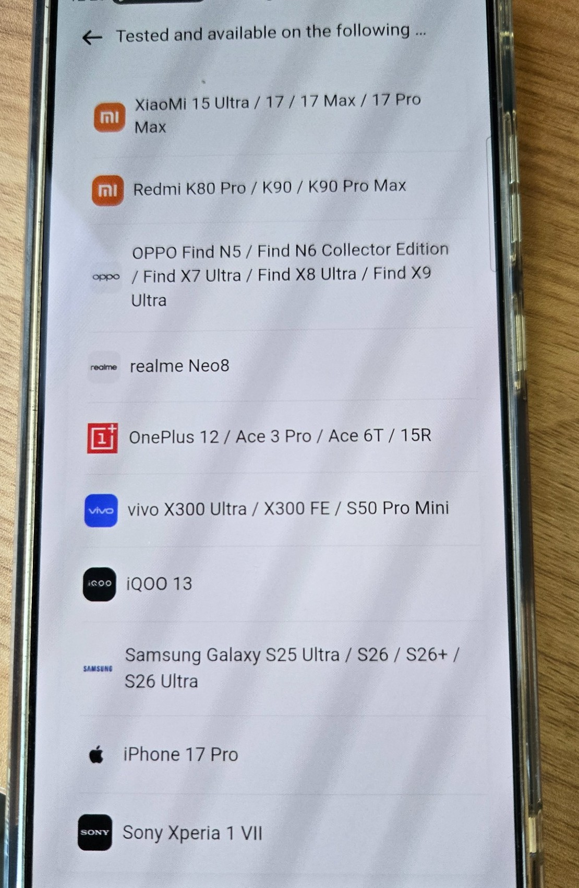

# Rokid AI Glasses Style — Consumer, Developer, and Research Guide

An independent, community-maintained guide to the **display-free Rokid AI
Glasses Style** and the **Hi Rokid** companion app.

This repository is designed as a one-stop starting point for:

- consumers deciding whether the glasses fit their needs;
- owners setting up, updating, and troubleshooting the product;
- developers evaluating SDKs, companion applications, and community projects;
- researchers studying Bluetooth, cloud AI, visual AI, local models, privacy, and firmware.

> Unofficial community project. Not affiliated with Rokid.

---

## Contents

- [Start here](#start-here)
- [What this product is](#what-this-product-is)
- [Quick answers](#quick-answers)
- [Consumer guide](#consumer-guide)
- [Phone and local-model compatibility](#phone-and-local-model-compatibility)
- [Architecture](#architecture)
- [Developer resources](#developer-resources)
- [Validated research](#validated-research)
- [Privacy and evidence](#privacy-and-evidence)
- [Repository layout](#repository-layout)
- [Contributing](#contributing)

## Start here

| Goal | Recommended page |
|---|---|
| Understand the product | [Product overview](docs/consumer/product-overview.md) |
| Pair and configure the glasses | [Getting started](docs/consumer/getting-started.md) |
| Check phone or local-model support | [Phone compatibility](docs/consumer/phone-and-local-model-compatibility.md) |
| Troubleshoot pairing, power, or updates | [Troubleshooting](docs/consumer/troubleshooting.md) |
| Understand the non-display architecture | [Architecture](docs/architecture/non-display-system-architecture.md) |
| Evaluate SDK and development options | [SDK guide](docs/development/sdk-and-development-options.md) |
| Find community projects | [Community ecosystem](docs/development/community-ecosystem.md) |
| Review independent tests | [Test matrix](docs/tests/test-matrix.md) |
| Understand the visual-assistant workflow | [Visual AI workflow](docs/findings/visual-ai-workflow.md) |
| Reproduce a test | [Public scripts](scripts/README.md) |

## What this product is

This repository focuses on **Rokid AI Glasses Style**, the display-free,
voice-first model. Some packaging and app screens may use the shorter name
“Rokid AI Glasses.” It should not be confused with **Rokid Glasses**, the
separate display-equipped product.

The Style experience centers on:

- a first-person camera;
- microphones and open-ear speakers;
- voice-first AI interaction;
- Bluetooth and Wi-Fi connectivity;
- the Hi Rokid phone application;
- audio and phone-screen output instead of an in-lens HUD.

See [Product overview](docs/consumer/product-overview.md).

## Quick answers

### Does the Style model have a display?

No. It is display-free. Responses and status are delivered mainly through
open-ear audio and Hi Rokid on the phone.

### Is a phone required?

Some capture and audio functions may work without continuous phone interaction,
but Hi Rokid is central to pairing, settings, AI model selection, local-model
management, media, translation configuration, and firmware updates.

### Does selecting ChatGPT or Gemini change anything?

Yes. Test 14A-r2 confirmed that Hi Rokid sends different opaque
`base_model_no` values for the ChatGPT and Gemini selections. Both use a
Rokid-managed AI WebSocket gateway. The evidence does not expose the exact
downstream public model version.

### Are assistant answers generated locally?

The tested assistant path was cloud-mediated: the app uploaded audio and
received server-side speech recognition, LLM text, and synthesized speech. A
local Qwen3-family `Wend_Audio` component was observed, but it was identical
across both routes and is not proof of local answer generation.

### How does the visual assistant handle an image?

A visually grounded question is recognized by Rokid's cloud, which returns a
`take_photo` tool action. Hi Rokid then asks the glasses to capture a WebP
frame, receives it over Bluetooth, uploads it to Rokid-managed object storage,
and sends the object URL through the AI WebSocket.

ChatGPT and Gemini visual selections use different `vl_model_no` routes.
Specific visual follow-ups take a **new current-scene photo** rather than
reusing the previous frame. Conversation thumbnails remain available from a
local app-private cache after a process restart and while the phone is offline.

See [Test 15](docs/tests/15-visual-ai-architecture-routing-retention.md).

### How are firmware updates checked?

When the glasses are connected, Hi Rokid checks automatically after app launch,
checks again when the firmware page opens, and sends a new live request for
each manual check. The app submits the installed version to Rokid's OTA service
and receives a complete OTA manifest.

### Which phones support local models?

Hi Rokid contains an in-app “tested and available” list. The captured list and
its limitations are documented in
[Phone and local-model compatibility](docs/consumer/phone-and-local-model-compatibility.md).

## Consumer guide

- [Product overview](docs/consumer/product-overview.md)
- [Getting started](docs/consumer/getting-started.md)
- [Features and limitations](docs/consumer/features-and-limitations.md)
- [Phone and local-model compatibility](docs/consumer/phone-and-local-model-compatibility.md)
- [Troubleshooting](docs/consumer/troubleshooting.md)

## Phone and local-model compatibility

The current lab uses a **Samsung Galaxy S25 Ultra** as the primary phone.
Earlier work used a Motorola Razr 2024 and a Pixel 7 for narrower tests.

The app-displayed list captured on 2026-07-20 includes selected Xiaomi, Redmi,
OPPO, realme, OnePlus, vivo, iQOO, Samsung, Apple, and Sony devices. It is an
app-version snapshot, not a permanent support guarantee.

## Architecture

The [architecture guide](docs/architecture/non-display-system-architecture.md)
separates:

1. glasses hardware and embedded software;
2. Bluetooth/Wi-Fi device and media channels;
3. the Hi Rokid phone application;
4. Rokid-operated AI, OTA, account, mapping, and ancillary services.

Validated flows:

- [AI assistant routing](docs/findings/ai-assistant-routing.md)
- [Visual AI workflow](docs/findings/visual-ai-workflow.md)
- [Firmware update path](docs/findings/firmware-update-path.md)

## Developer resources

Rokid development material spans several product families. Do not assume a
sample built for display-equipped Rokid Glasses will work on the display-free
Style model.

Start with:

- [SDK and development options](docs/development/sdk-and-development-options.md)
- [Community ecosystem](docs/development/community-ecosystem.md)
- [Non-display architecture](docs/architecture/non-display-system-architecture.md)
- [awesome-rokid](https://github.com/Anezium/awesome-rokid), a broader index
  across many Rokid products
- [Community Rokid platform documentation](https://github.com/buildwithfenna/rokid-docs)

SDK and project references are included for discovery even where Style
compatibility has not yet been validated.

## Validated research

Published qualification sets include:

- **Test 14A / 14A-r2** — voice assistant ChatGPT/Gemini routing;
- **Test 14B** — firmware-check triggers and OTA version resolution;
- **Test 15A / 15B** — visual capture, routing, retention, and context behavior.

Highlights:

- Voice ChatGPT and Gemini selections propagate different `base_model_no`
  values.
- Visual ChatGPT and Gemini selections propagate different `vl_model_no`
  values while the visual base route remains fixed.
- Assistant audio is sent to a Rokid-managed WebSocket gateway.
- Text first appears in server-side `recognized_speech`.
- Visual questions trigger a server `take_photo` tool action.
- The glasses return WebP images over Bluetooth; Hi Rokid uploads them to
  Rokid-managed Aliyun OSS and sends object URLs to the AI service.
- Specific visual follow-ups recapture the current scene rather than reusing
  the previous image.
- Conversation text and thumbnails remain available offline from a persistent
  app-private cache.
- AI answer speech is synthesized in Rokid's cloud and streamed to the glasses;
  phone TTS was not observed generating those answers.
- No direct public OpenAI, Gemini, Microsoft TTS, or other downstream provider
  API request was observed from the phone.
- Firmware checking is connection-gated and uses a hybrid server/client policy.

See [Test matrix](docs/tests/test-matrix.md).

## Privacy and evidence

Raw captures and credentials are not stored in this public repository.

Do not commit:

- PCAP/PCAPNG files or TLS key logs;
- raw logcat, bugreports, HCI logs, or decrypted payload dumps;
- tokens, account IDs, serials, Bluetooth addresses, or precise location;
- APKs, native libraries, or decompiled application trees;
- screenshots containing private account or device information.

Public material is limited to sanitized reports, generalized scripts,
non-sensitive images, protocol summaries, and hash-only provenance records.

See [Evidence handling](docs/methodology/evidence-handling.md).

## Repository layout

- `docs/consumer/` — ownership, setup, compatibility, features, troubleshooting
- `docs/architecture/` — non-display hardware/app/cloud architecture
- `docs/development/` — SDK applicability and community projects
- `docs/tests/` — completed reports and master matrix
- `docs/runbooks/` — reproducible procedures
- `docs/findings/` — consolidated findings
- `docs/methodology/` — evidence and analysis procedures
- `docs/research/` — evidence levels and interpretation rules
- `docs/assets/` — reviewed public images
- `evidence/sanitized/` — public summaries derived from private captures
- `evidence/manifests/` — hash-only provenance
- `scripts/tests/` — interactive capture runners
- `scripts/recovery/` — bounded MediaStore recovery/finalization
- `scripts/safety/` — public-repository privacy gates

## Contributing

Contributions are welcome for consumer guidance, compatibility reports,
developer resources, reproducible tests, and corrections.

Label important claims as:

- **Official** — stated by Rokid;
- **Observed** — captured or reproduced;
- **Inferred** — best-supported interpretation;
- **Unverified** — listed for discovery but not tested.

Read [CONTRIBUTING.md](CONTRIBUTING.md).

## Disclaimer

This project is not affiliated with Rokid. Product names and trademarks belong
to their respective owners. Testing is performed only on devices and accounts
controlled by the repository owner.
