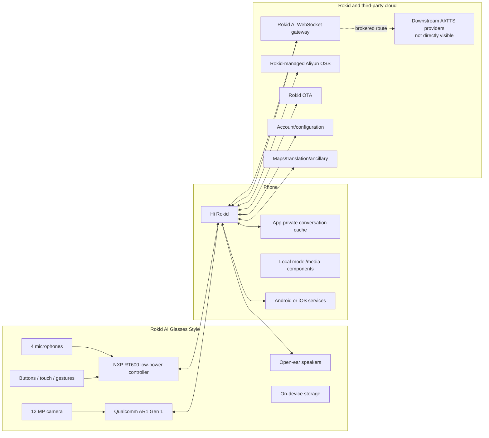
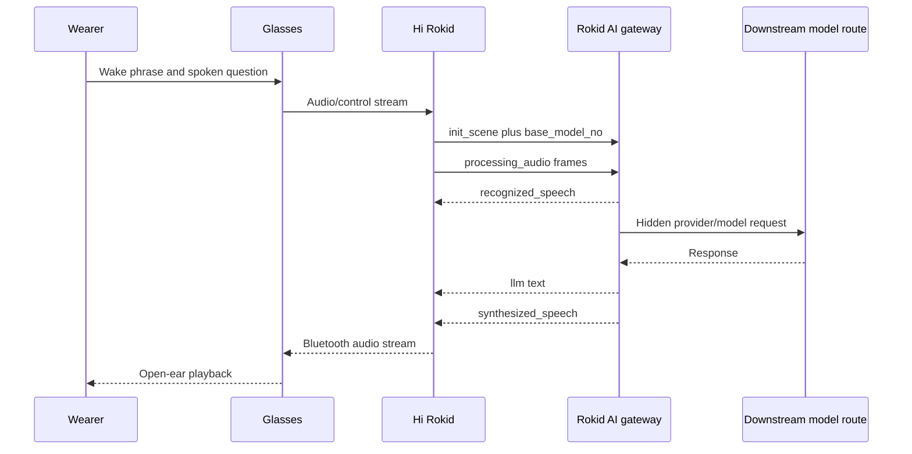
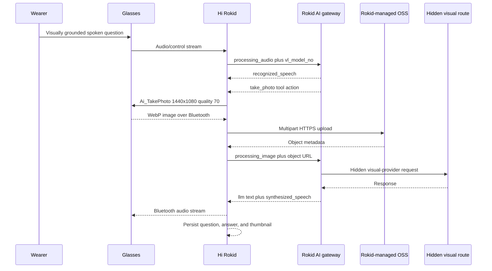
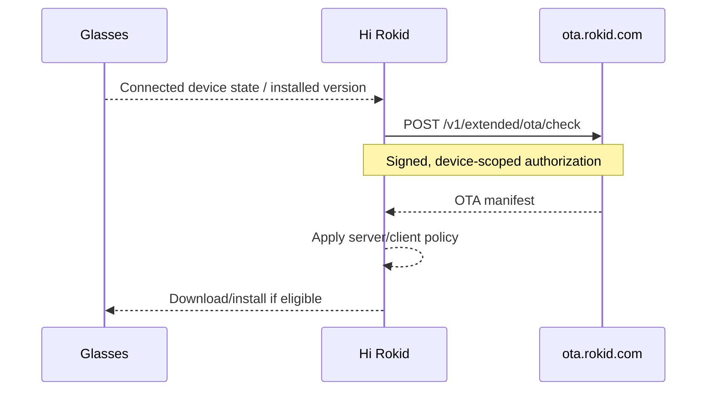

# Non-Display System Architecture

## Scope

Best-supported architecture of the display-free Rokid AI Glasses Style,
combining official product information with independently observed Hi Rokid
behavior.

Evidence labels:

- **Official** — published by Rokid;
- **Observed** — directly captured or reproduced;
- **Inferred** — best-supported interpretation;
- **Unverified** — plausible or documented for another product but not tested
  on Style.

## System view



## Hardware layer

**Official:** Qualcomm AR1 Gen 1, NXP RT600 family, 12 MP camera, four
microphones, open-ear speakers, Bluetooth 5.3, Wi-Fi 6, 2 GB RAM, 32 GB
storage, and no display.

The exact processor responsibility split is not fully exposed to third-party
developers.

## Phone and device-control layer

**Observed:**

- Hi Rokid is the primary pairing and management surface.
- Device/account binding is enforced.
- Multiple Bluetooth transports have been observed.
- Firmware controls are unavailable while disconnected.
- The firmware page generated an `Ota_MsgNotify` event.
- Visual image frames return from the glasses through Bluetooth.
- Assistant answer audio is streamed from Hi Rokid back to the glasses.

**Inferred:** Hi Rokid acts as the orchestration bridge between glasses
hardware, app-private state, and Rokid's cloud services.

## Voice assistant sequence



**Observed:**

- `wss://ai-cloud-global.rokid.com/ws/ai`;
- voice ChatGPT/Gemini selections use different `base_model_no` values;
- the client sends audio rather than the final text question;
- text first appears in server `recognized_speech`;
- the server streams `llm` and `synthesized_speech`;
- no direct public provider API request was observed from the phone.

## Visual assistant sequence



### Capture trigger

Opening or remaining in Assistant did not capture an image. A capture began
only after server ASR and a server `take_photo` tool action.

Observed camera command:

```text
Ai_TakePhoto {"width":1440,"height":1080,"quality":70}
```

### Image transport

The glasses returned a WebP frame over Bluetooth. Hi Rokid uploaded the frame
through multipart HTTPS to Rokid-managed Aliyun OSS. The AI WebSocket received
an object URL through `processing_image`, not raw image bytes.

Observed image properties:

- WebP
- `1080 × 1440`
- RGB
- single frame
- no EXIF
- no GPS metadata
- ICC profile present

No normal Android Gallery/MediaStore image was created.

## Model routing

Hi Rokid's model catalog separates base and multi/visual routes.

### Base routes

| UI name | Route identifier |
|---|---|
| ChatGPT | `2d6h8m3qk7s5p9` |
| Gemini | `gEmpl2XKDqHRNDsL` |

### Multi/visual routes

| UI name | Route identifier |
|---|---|
| ChatGPT | `5d9h11m6qk10s8p12` |
| Gemini | `gEmEcBf6rTsSwdRc` |

Voice-only selections propagate through `base_model_no`.

Visual selections propagate through `vl_model_no`. In tested visual sessions,
`base_model_no` remained on `gEmpl2XKDqHRNDsL` for both selections while
`vl_model_no` changed.

A live ChatGPT-to-Gemini `vl_model_no` transition occurred inside one
conversation without creating a new conversation identifier.

The exact downstream public models remain hidden.

## Visual follow-ups and context

Test 15 observed two behaviors:

- a vague reference to “the image you just saw” caused no recapture and
  received a clarification question;
- a specific question about a visible detail caused a fresh `take_photo`,
  Bluetooth WebP, OSS upload, `processing_image`, and thumbnail.

Therefore, the tested system refreshes the current scene for grounded visual
follow-ups. It did not prove that the prior image remains in model context.

## Conversation retention

Every captured frame appeared as a thumbnail beside its question.

After force-stopping and relaunching Hi Rokid while the phone was offline:

- prior question and answer text remained;
- prior thumbnails remained;
- thumbnails rendered without placeholders;
- no successful network request was possible.

An online restart also rendered the thumbnails without a direct OSS fetch.

Best-supported storage architecture:

```text
Remote full-image object plus persistent app-private local cache
```

The precise private cache/database path was not accessible.

## TTS and audio delivery

Visual and voice answers arrive as Rokid WebSocket `synthesized_speech` events
using a Rokid `moss_audio` voice identifier. Hi Rokid forwards the resulting
audio to the glasses through its Bluetooth audio stream.

Android Google TTS initializes inside Hi Rokid but was not observed generating
the assistant answers. Microsoft/Azure TTS was not observed on the phone.
Rokid's upstream cloud TTS provider remains unknown.

## Firmware sequence



The response included a package URL, checksum, changelog, force-update state,
authorization state, and package-selection metadata.

## Local-model layer

Hi Rokid exposes a phone compatibility list. Assistant tests observed the same
approximately 596M-parameter Qwen3-family `Wend_Audio` component across routes.

**Inferred:** ancillary edge/audio function.

**Not supported:** that voice or visual assistant answers were generated by
this local component.

## Trust boundaries

| Boundary | Primary concern |
|---|---|
| Glasses ↔ phone | Device control, audio, media, firmware state |
| Phone app-private cache | Conversation text and image thumbnails |
| Phone ↔ Rokid account | Identity, binding, preferences |
| Phone ↔ AI gateway | Audio, context, model routes, responses |
| Phone ↔ object storage | Current-scene image bytes and upload credentials |
| Phone ↔ OTA | Device identity, installed version, package policy |
| Rokid ↔ providers | Hidden visual, language, and TTS providers |
| Public repo ↔ private lab | Redaction, hashes, reproducibility |

## Open questions

- Exact Bluetooth RFCOMM/DLCI image framing
- Exact upstream language, visual, and TTS providers
- App-private thumbnail cache path, format, expiry, and deletion
- OSS object accessibility, lifetime, and deletion behavior
- Retention after logout, unbind, or Android storage cleanup
- Complete glasses-side service inventory
- Style-specific public SDK contract
- Local-model lifecycle and offline boundaries
- Firmware signature-verification implementation
