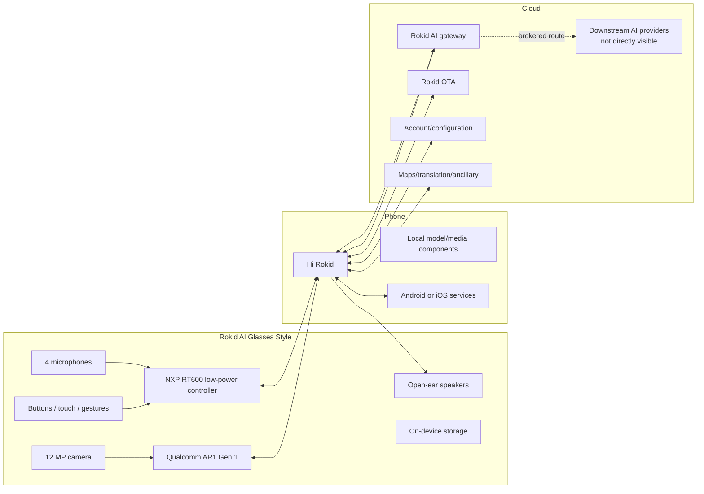
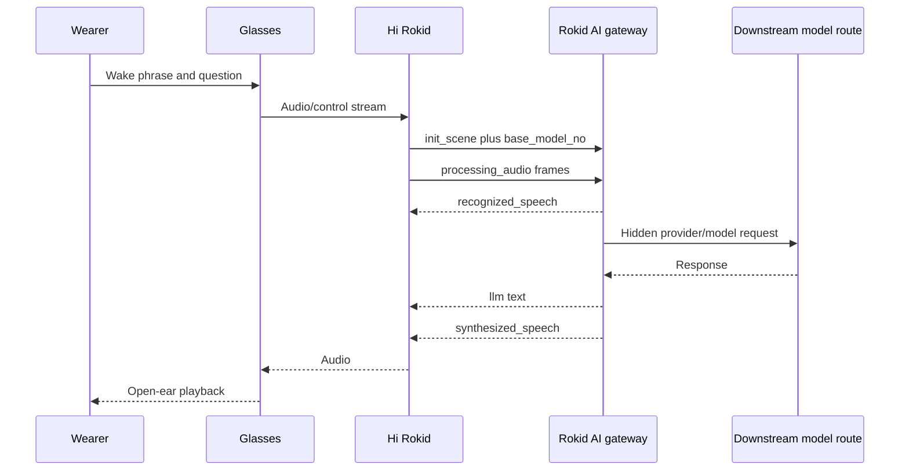
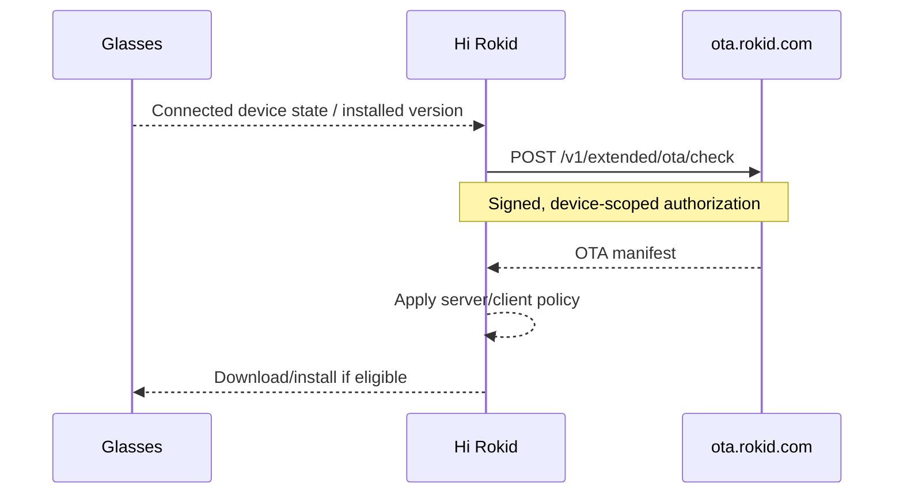

# Non-Display System Architecture

## Scope

Best-supported architecture of the display-free Rokid AI Glasses Style,
combining official product information with independently observed Hi Rokid
behavior.

## System view



## Hardware layer

**Official:** Qualcomm AR1 Gen 1, NXP RT600 family, 12 MP camera, four
microphones, open-ear speakers, Bluetooth 5.3, Wi-Fi 6, 2 GB RAM, 32 GB
storage, and no display.

The exact division of responsibilities between processors is not fully exposed
to third-party developers.

## Phone/device layer

**Observed:**

- Hi Rokid is the primary pairing and management surface.
- Device/account binding is enforced.
- Multiple Bluetooth transports have been observed in earlier work.
- Firmware controls are unavailable while disconnected.
- The firmware page generated an `Ota_MsgNotify` event.

**Inferred:** the app obtains or confirms installed firmware state from the
connected device before requesting OTA metadata.

## AI assistant sequence



**Observed:**

- `wss://ai-cloud-global.rokid.com/ws/ai`;
- different ChatGPT/Gemini `base_model_no` values;
- audio uploaded by the client;
- text first appears in server `recognized_speech`;
- server `llm` and `synthesized_speech` events;
- no direct public provider API request.

**Not proven:** exact downstream model, private system prompt, or one-to-one
provider mapping.

## Firmware sequence



Observed request:

```json
{
  "version": "1.22.009-20260710-151201",
  "osType": "",
  "cpuType": ""
}
```

The response included package URL, checksum, changelog, `isForceUpdate`,
authorization state, and package-selection metadata.

## Local-model layer

Hi Rokid exposes a phone compatibility list. Both Test 14A routes loaded the
same approximately 596M-parameter Qwen3-family `Wend_Audio` component.

**Inferred:** ancillary edge/audio function.

**Not supported:** that the selected assistant answer was generated by that
local component.

## Trust boundaries

| Boundary | Primary concern |
|---|---|
| Glasses ↔ phone | Device control, audio, media, firmware state |
| Phone ↔ Rokid account | Identity, binding, preferences |
| Phone ↔ AI gateway | Audio, context, route selection, responses |
| Phone ↔ OTA | Device identity, installed version, package policy |
| Rokid ↔ providers | Hidden model request and policy |
| Public repo ↔ private lab | Redaction, hashes, reproducibility |

## Open questions

- Raw Bluetooth firmware-version command
- Exact upstream AI provider request
- Complete glasses-side service inventory
- Style-specific public SDK contract
- Local-model lifecycle and offline boundaries
- Firmware signature-verification implementation
