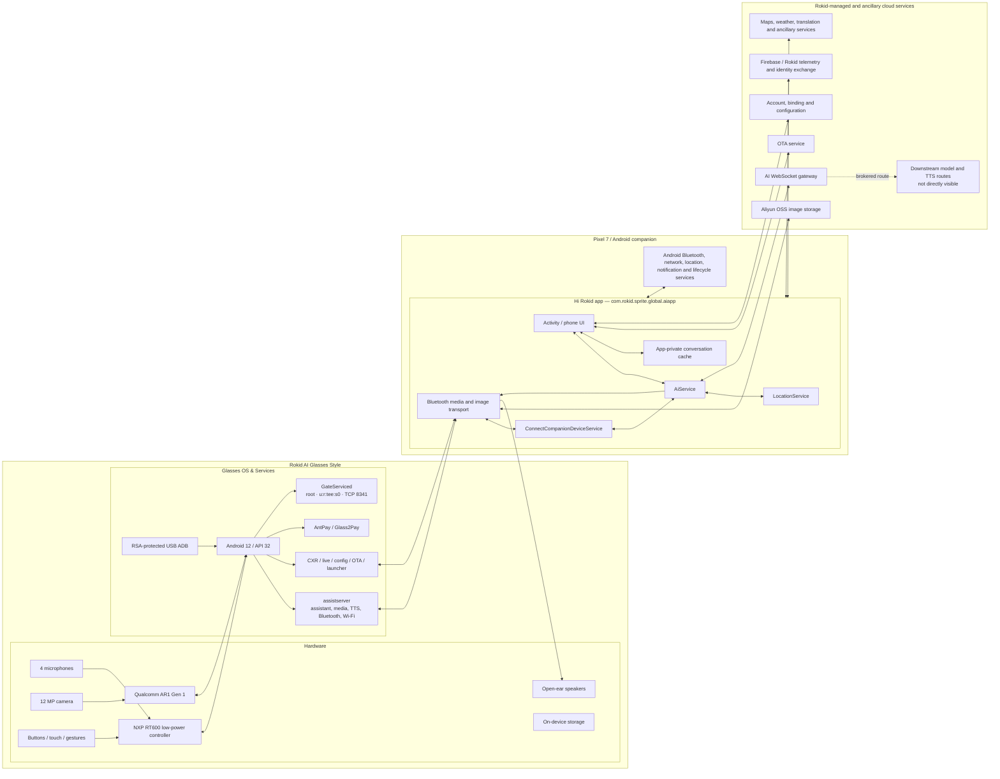
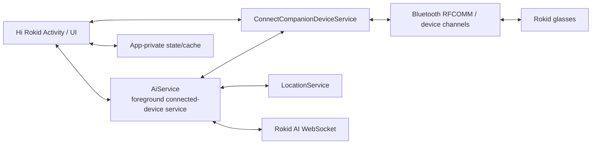
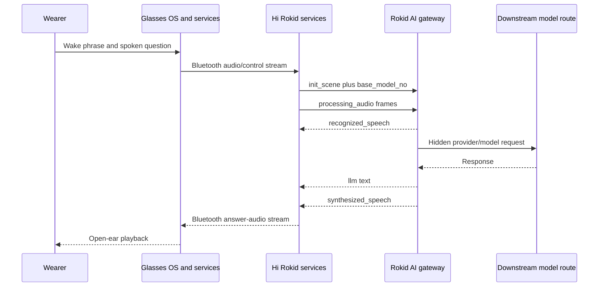
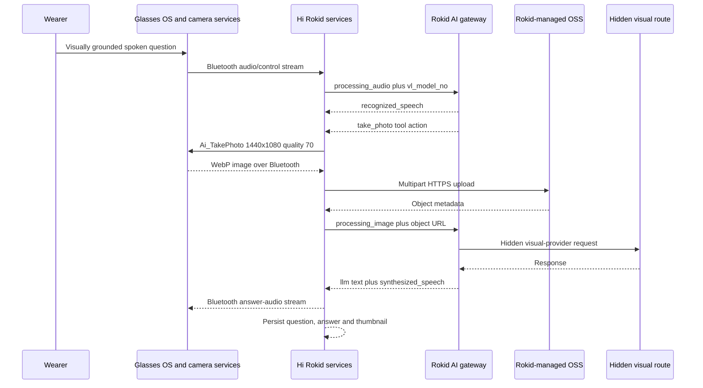
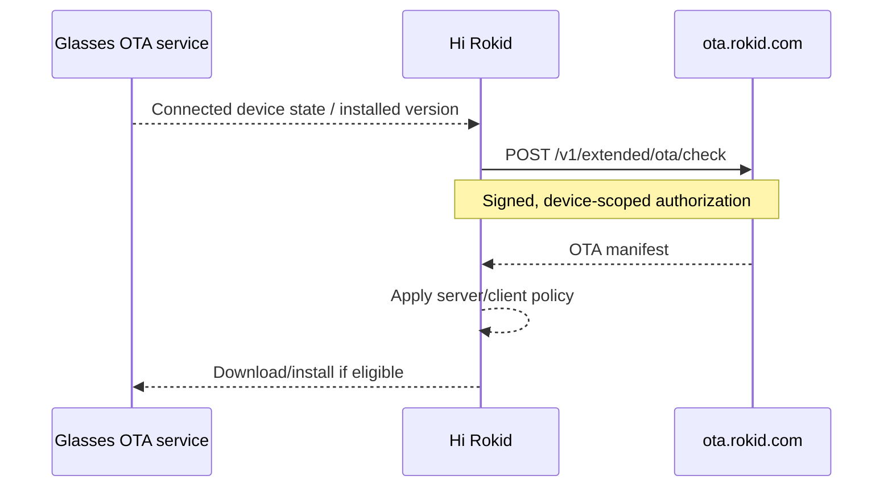

# Non-Display System Architecture — Glasses OS, Services, and Hi Rokid

## Scope

Best-supported architecture of the display-free Rokid AI Glasses Style,
combining official product information with independently observed behavior on
the glasses and in the global **Hi Rokid** Android application.

This document deliberately separates three layers that are easy to conflate:

1. the glasses hardware and embedded Android operating system;
2. the Hi Rokid companion application and its Android services;
3. Rokid-operated cloud, object-storage, account, and OTA services.

Evidence labels:

- **Official** — published by Rokid;
- **Observed** — directly captured or reproduced;
- **Inferred** — best-supported interpretation;
- **Unverified** — plausible or documented for another product but not tested
  on Style.

## Architecture at a glance



## Hardware layer

**Official:** Qualcomm AR1 Gen 1, NXP RT600 family, 12 MP camera, four
microphones, open-ear speakers, Bluetooth 5.3, Wi-Fi 6, 2 GB RAM, 32 GB
storage, and no display.

The exact responsibility split between the low-power controller and the
application processor is not fully exposed to third-party developers.

## Glasses OS & Services

### Operating-system baseline

**Observed in Test 17:** the tested US non-display unit runs Android 12/API 32
on an arm64 production `user/release-keys` build.

| Property | Observed state |
|---|---|
| Device model | `RG-glasses` |
| Android | 12 / API 32 |
| Kernel | 5.10.209 family |
| Build | `user` / `release-keys` |
| `ro.secure` | `1` |
| `ro.debuggable` | `0` |
| `ro.adb.secure` | `1` |
| Persistent USB function | `persist.sys.usb.config=adb` |
| Android ADB setting | `global.adb_enabled=1` |
| Wireless ADB | disabled |
| Ordinary third-party packages | none observed |

RSA-protected USB ADB worked through the original Rokid data/debug cable. The
build did not expose normal `adb root`. The unit reported
`verifiedbootstate=orange` and `vbmeta.device_state=unlocked`, but the origin of
that state was not determined. No flashing, relocking, root, partition write,
or bootloader experiment was performed.

The verified system-image mounts were read-only. Writable `/data` was
approximately 19 GB with substantial free space during collection. The public
repository records only a high-level storage summary, not a raw partition map
or partition images.

### Preloaded Rokid application stack

The device is not merely a Bluetooth microphone and speaker. It contains a
privileged, preloaded Android application stack.

| Package | Observed role |
|---|---|
| `com.rokid.os.sprite.assistserver` | Central system assistant-service host |
| `com.rokid.os.sprite.live` | Live/media workflow component |
| `com.rokid.sysconfig` | System and product configuration |
| `com.rokid.cxrservice` | Rokid CXR connection/runtime component |
| `com.rokid.glass.ota` | Glasses-side OTA component |
| `com.rokid.os.master.screenstream` | Screen/media streaming component |
| `com.rokid.os.sprite.launcher` | Glasses launcher and application entry layer |
| `com.iap.mobile.ar_pay` | Preloaded AntPay component |

Eight privately preserved APK files matched their device-side SHA-256 hashes.
The repository publishes hashes and package metadata, not APK binaries or
decompilation output.

### Assistant-server services

The central `com.rokid.os.sprite.assistserver` process ran under Android system
UID 1000 and hosted multiple services:

| Service | Best-supported role |
|---|---|
| `MasterAssistService` | Assistant orchestration and device-side session control |
| `InstructService` | Commands and instruction dispatch |
| `SpriteMediaService` | Glasses media capture and playback coordination |
| `SystemFuncService` | System-function bridge |
| `TtsService` | Local/system text-to-speech support and prompts |
| `PaymentService` | Rokid payment-capability integration |
| `WebServerService` | Controllable Java web-server component; observed disabled |
| `RokidBluetoothService` | Bluetooth control and transport integration |
| `SpriteWifiService` | Wi-Fi and Wi-Fi Direct control integration |

A local TTS service exists on the glasses, but this does not overturn the
phone-side evidence that stock assistant answer audio was delivered from the
Rokid AI WebSocket path. The local service may handle system prompts or other
on-device speech functions.

### Payment components

`com.iap.mobile.ar_pay` was preloaded as an AntPay product application. Its
`Glass2PayService` was bound by the assistant-server stack, and a separate
Rokid `PaymentService` was active.

This explains why the earlier AI `init_scene` message contained
payment-capability configuration. It is not evidence that Google Wallet,
Samsung Wallet, card credentials, or a user payment account were accessed.

### GateServiced and TCP port 8341

A native process named `GateServiced` was launched by
`/vendor/etc/init/init.gateserviced.rc` from `/vendor/bin/GateServiced`.

Observed properties:

| Property | Observed state |
|---|---|
| Parent | Android `init` |
| UID/GID | 0 / 0 |
| SELinux domain | `u:r:tee:s0` |
| Effective capabilities | full kernel-supported mask |
| `NoNewPrivs` | 0 |
| Seccomp | 0 |
| TCP listener | `0.0.0.0:8341` |

The listener was attributed to `GateServiced` with very high confidence using
process, init, UID/inode, service-state, and independent platform evidence. The
production SELinux and `/proc` policy prevented a direct socket-FD-to-PID link.

No request, protocol probe, fuzzing payload, or exploit attempt was sent to
port 8341. During all collected baselines, `wlan0`, `p2p0`, and
`wifi-aware0` were down and no IP route existed, so the wildcard listener was
not externally reachable at those moments.

### Other platform capabilities

The Android stack exposed native Wi-Fi and Bluetooth infrastructure, including
Wi-Fi Direct-related components and Bluetooth profiles for GATT, HFP client,
PBAP client, A2DP sink, AVRCP controller, HID host, and PAN. Presence indicates
software capability; it does not prove that each profile was active during the
tested workflows.

## Hi Rokid App & Services

### Package boundary

The tested Android companion application is:

```text
com.rokid.sprite.global.aiapp
```

A clean-install inventory found no second AI package and no separately
installed application corresponding to the UI label “AI Service.” The
assistant runtime and background services are components inside the Hi Rokid
package.

### Primary Android services

| Component | Observed responsibility |
|---|---|
| Hi Rokid Activity/UI | Pairing, settings, model selection, firmware, history and phone-facing controls |
| `AiService` | Foreground connected-device and AI-session runtime |
| `ConnectCompanionDeviceService` | Persistent glasses transport and reconnection |
| `LocationService` | Location context used by supported app workflows |
| App-private cache/database | Conversation text, answers and retained thumbnails |

Hi Rokid also uses Android Bluetooth, networking, notification, location, media,
process-lifecycle, and foreground-service facilities. The exact private class
inventory is intentionally not published from raw app dumps.

### Responsibilities observed on the phone

Hi Rokid acts as the orchestration hub for:

- account login, device binding and configuration;
- Bluetooth control, audio, image and media transport with the glasses;
- ChatGPT/Gemini base and visual route selection;
- AI WebSocket initialization and audio/image message exchange;
- upload of visual frames to Rokid-managed object storage;
- forwarding synthesized answer audio to the glasses;
- firmware-version checks and OTA policy resolution;
- phone-local conversation text and thumbnail retention;
- location, weather, payment-capability and device context supplied to supported
  workflows.

### Lifecycle behavior

Test 16 established that the visible Hi Rokid Activity is only one part of the
phone-side runtime.



| Android action | Observed result |
|---|---|
| Remove task from Recents | UI task removed; process, services, Bluetooth connection and AI WebSocket may continue |
| Turn screen off | Existing service and WebSocket remained active in the tested window |
| Deny notification permission | Services can remain active without a visible AI Service notification |
| Force-stop package | Process, services, RFCOMM and WebSocket terminated in the S25 control |
| Relaunch app | Services and glasses connection re-established; AI initialization repeated |

The Pixel in-app “Allow Rokid App to run in the background” banner did not
reliably describe the lower-level Android state. Before the banner was
satisfied, Android already reported allowed background/foreground-service
app-ops, active services, and a WebSocket that survived both the Recents swipe
and the screen-off period.

### Login, telemetry and AI-session initialization

Before Rokid account login, the global app contacted Firebase and Rokid
telemetry services. The observed Rokid token field was empty. Login used
Firebase Identity Toolkit before a Rokid-side token/session exchange.

When the AI WebSocket initializes, Hi Rokid sends an `init_scene` message. The
sanitized evidence confirmed category presence for:

- account identity;
- phone, glasses and connection state;
- precise latitude/longitude and weather context;
- model-route fields;
- payment-capability configuration.

Private values, tokens, account identifiers, precise coordinates and device
identifiers are excluded from public evidence.

After a Recents swipe, the tested stable connection exchanged binary ping/pong
keepalives at approximately ten-second intervals. No new audio, image, prompt,
`init_scene`, latitude/longitude, user-ID, or payment-binding message was
observed during the segmented screen-on and screen-off idle windows. A later
reconnect may send a new `init_scene`; no reconnect occurred in those segments.

## Phone and device-control layer

**Observed:**

- Hi Rokid is the primary pairing and management surface.
- Device/account binding is enforced.
- Multiple Bluetooth transports have been observed.
- Firmware controls are unavailable while disconnected.
- The firmware page generated an `Ota_MsgNotify` event.
- Visual image frames return from the glasses through Bluetooth.
- Assistant answer audio is streamed from Hi Rokid back to the glasses.

**Inferred:** Hi Rokid is the orchestration bridge between the privileged
on-glasses service stack, phone-private state, and Rokid's remote services.

## Voice assistant sequence



**Observed:**

- `wss://ai-cloud-global.rokid.com/ws/ai`;
- voice ChatGPT/Gemini selections use different `base_model_no` values;
- the client sends audio rather than the final text question;
- text first appears in server `recognized_speech`;
- the server streams `llm` and `synthesized_speech`;
- no direct public provider API request was observed from the phone.

During the passive Test 17 voice workflow, the glasses did not activate
`wlan0`, `p2p0`, Wi-Fi Aware, or an IP route. The paired phone remained the
best-supported cloud-network gateway.

## Visual assistant sequence



### Capture trigger

Opening or remaining in Assistant did not capture an image. A capture began
only after server ASR and a server `take_photo` tool action.

Observed camera command:

```text
Ai_TakePhoto {"width":1440,"height":1080,"quality":70}
```

### Image transport

The glasses returned a WebP frame over Bluetooth. Hi Rokid uploaded the frame
through multipart HTTPS to Rokid-managed Aliyun OSS. The AI WebSocket received
an object URL through `processing_image`, not raw image bytes.

Observed image properties:

- WebP;
- `1080 × 1440`;
- RGB;
- single frame;
- no EXIF;
- no GPS metadata;
- ICC profile present.

No normal Android Gallery/MediaStore image was created.

During the passive Test 17 visual workflow, the glasses again did not activate
`wlan0`, `p2p0`, Wi-Fi Aware, or an IP route. This strongly supports the phone
as the cloud-network gateway and Bluetooth/Rokid transport as the glasses-to-
phone image leg for the tested stock workflow.

## Model routing

Hi Rokid's model catalog separates base and multi/visual routes.

### Base routes

| UI name | Route identifier |
|---|---|
| ChatGPT | `2d6h8m3qk7s5p9` |
| Gemini | `gEmpl2XKDqHRNDsL` |

### Multi/visual routes

| UI name | Route identifier |
|---|---|
| ChatGPT | `5d9h11m6qk10s8p12` |
| Gemini | `gEmEcBf6rTsSwdRc` |

Voice-only selections propagate through `base_model_no`.

Visual selections propagate through `vl_model_no`. In tested visual sessions,
`base_model_no` remained on `gEmpl2XKDqHRNDsL` for both selections while
`vl_model_no` changed.

A live ChatGPT-to-Gemini `vl_model_no` transition occurred inside one
conversation without creating a new conversation identifier.

The exact downstream public models remain hidden.

## Visual follow-ups and context

Test 15 observed two behaviors:

- a vague reference to “the image you just saw” caused no recapture and
  received a clarification question;
- a specific question about a visible detail caused a fresh `take_photo`,
  Bluetooth WebP, OSS upload, `processing_image`, and thumbnail.

Therefore, the tested system refreshes the current scene for grounded visual
follow-ups. It did not prove that the prior image remains in model context.

## Conversation retention

Every captured frame appeared as a thumbnail beside its question.

After force-stopping and relaunching Hi Rokid while the phone was offline:

- prior question and answer text remained;
- prior thumbnails remained;
- thumbnails rendered without placeholders;
- no successful network request was possible.

An online restart also rendered the thumbnails without a direct OSS fetch.

Best-supported storage architecture:

```text
Remote full-image object plus persistent app-private local cache
```

The precise private cache/database path was not accessible.

## TTS and audio delivery

Visual and voice answers arrive as Rokid WebSocket `synthesized_speech` events
using a Rokid `moss_audio` voice identifier. Hi Rokid forwards the resulting
audio to the glasses through its Bluetooth audio stream.

Android Google TTS initializes inside Hi Rokid but was not observed generating
the assistant answers. Microsoft/Azure TTS was not observed on the phone.
Rokid's upstream cloud TTS provider remains unknown.

## Firmware sequence



The response included a package URL, checksum, changelog, force-update state,
authorization state, and package-selection metadata.

## Local-model layer

Hi Rokid exposes a phone compatibility list. Assistant tests observed the same
approximately 596M-parameter Qwen3-family `Wend_Audio` component across routes.

**Inferred:** ancillary edge/audio function.

**Not supported:** that voice or visual assistant answers were generated by
this local component.

## Trust boundaries

| Boundary | Primary concern |
|---|---|
| Glasses hardware ↔ glasses OS | Camera, microphone, buttons, storage and local privileged services |
| Glasses OS ↔ phone | Device control, audio, media and firmware state |
| Hi Rokid services ↔ phone OS | Background execution, permissions, location, notifications and lifecycle |
| Phone app-private cache | Conversation text and image thumbnails |
| Phone ↔ Rokid account | Identity, binding and preferences |
| Phone ↔ AI gateway | Audio, sensitive scene context, model routes and responses |
| Phone ↔ object storage | Current-scene image bytes and upload credentials |
| Phone ↔ OTA | Device identity, installed version and package policy |
| Rokid ↔ providers | Hidden visual, language and TTS providers |
| Public repo ↔ private lab | Redaction, hashes and reproducibility |

## Development implications

The validated architecture supports treating the product as two programmable
Android-adjacent endpoints rather than as one opaque accessory:

- a glasses-side Android system with privileged Rokid services and potential
  Glasses SDK application support;
- a phone-side companion application using Phone SDK or documented device
  channels;
- an optional local server for private ASR, translation, RAG, compliance or
  other inference workloads.

For third-party application work, the important next questions are not whether
the hardware can capture and play media—the stock stack proves that it can—but
whether the public SDK exposes the required microphone, camera, button,
message, file-transfer, P2P, and audio-playback hooks on this exact consumer
firmware without first-party privileges.

The dedicated development baseline keeps the glasses paired to the Pixel 7,
leaves Developer Mode enabled, and reserves the Samsung S25 for later
compatibility testing after custom applications work on the Pixel.

## Open questions

- Exact Bluetooth RFCOMM/DLCI framing for audio and images
- Exact upstream language, visual and TTS providers
- App-private thumbnail cache path, format, expiry and deletion behavior
- OSS object accessibility, lifetime and deletion behavior
- Retention after logout, unbind or Android storage cleanup
- Public/private API boundary of the privileged glasses-side services
- Consumer-firmware compatibility with official Glasses/Phone SDK demos
- Third-party access to camera, microphone, button and low-latency audio paths
- Whether custom applications can establish documented P2P locally without
  invoking stock cloud workflows
- Exact trigger and persistence model for the Hi Rokid Developer Mode control
- Local-model lifecycle and offline boundaries
- Firmware signature-verification implementation
