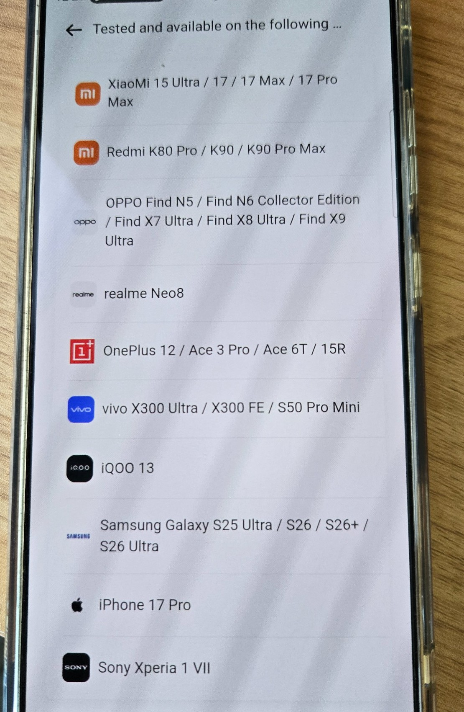

# Phone and Local-Model Compatibility — Moved

<!-- wiki-redirect: docs/consumer/phone-compatibility.md -->

The canonical consumer page is now
[Phone compatibility](phone-compatibility.md).

## Archived compatibility snapshot

The project transcribed the following Hi Rokid “tested and available” list on
2026-07-20. It reflects what the app displayed, not independent qualification.

| Brand | Models displayed |
|---|---|
| Xiaomi | 15 Ultra; 17; 17 Max; 17 Pro Max |
| Redmi | K80 Pro; K90; K90 Pro Max |
| OPPO | Find N5; Find N6 Collector Edition; Find X7 Ultra; Find X8 Ultra; Find X9 Ultra |
| realme | Neo8 |
| OnePlus | 12; Ace 3 Pro; Ace 6T; 15R |
| vivo | X300 Ultra; X300 FE; S50 Pro Mini |
| iQOO | 13 |
| Samsung | Galaxy S25 Ultra; S26; S26+; S26 Ultra |
| Apple | iPhone 17 Pro |
| Sony | Xperia 1 VII |

