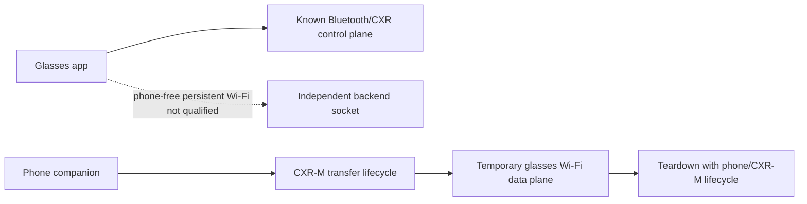

# Test 22 Developer Networking Boundary

<!-- wiki-status: audience=developer; applies_to=rokid-ai-glasses-style-non-display; evidence=validated; last_reviewed=2026-08-05 -->
## Page status

| Field | Value |
|---|---|
| Audience | Developer |
| Applies to | Rokid AI Glasses Style (non-display) |
| Evidence status | Validated |
| Last reviewed | 2026-08-05 |

## Practical result for replacement-app design

The Rokid AI Glasses Style are capable of real Wi-Fi client networking, but Test 22 did not identify an ordinary non-privileged application path that leaves the glasses with an independently persistent routed Wi-Fi connection after the phone/CXR-M session ends.

For replacement-app architecture, treat the current boundary as:

## Engineering implications

- Do not assume the absence of Wi-Fi hardware. `wlan0`, association, authentication, IPv4 provisioning, and routing were observed.
- Do not treat `settings_wifi_enable=true` delivery as proof that Android Wi-Fi became usable. The request reached AssistServer but no data-plane transition was observed in the bounded window.
- Do not depend on a CXR-M-created Wi-Fi route surviving phone removal. It did not survive in the final isolation experiment.
- Keep the phone in the architecture for network-gateway/orchestration use until a separately qualified independent route exists.
- A future privileged/system-signed or custom-firmware path is a separate research track and is outside Test 22.
- A future ordinary-app socket test while the temporary CXR-M network remains alive would answer a narrower coexistence question, not phone independence.

## Canonical read-only diagnostics

Use `scripts/tests/test22`; do not resurrect repair-specific command snippets. The canonical tool auto-selects the glasses when multiple ADB devices are attached and emits compact/redacted status only.
