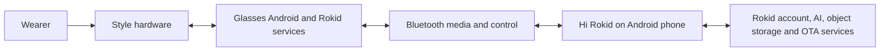
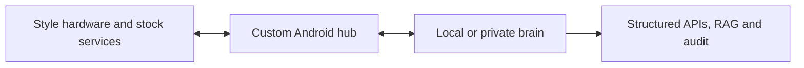

# Device Architecture for Developers

<!-- wiki-status: audience=developer; applies_to=rokid-ai-glasses-style-non-display; evidence=observed; last_reviewed=2026-07-30 -->

## Page status

| Field | Value |
|---|---|
| Audience | Developer |
| Applies to | Rokid AI Glasses Style (non-display) |
| Evidence status | Observed |
| Last reviewed | 2026-07-30 |

## Current stock path

The phone was the observed public-network gateway during the qualified voice
and visual workflows. The glasses also contain Wi-Fi, Wi-Fi Direct, Wi-Fi Aware,
and a privileged local listener, but those interfaces were not active public
AI gateways in the tested states.

## Target replacement path

## Known transport foundation

- independent RFCOMM open/close qualification;
- SCN `3`, DLCI `6`, MTU `990`;
- matching SABM/UA and DISC/UA lifecycle;
- zero application bytes in the accepted connection-only attempt;
- bounded stock ADB-toggle message grammar recovered without replay.

## Unknown application boundary

- SDK and model compatibility;
- binding/session ownership outside the stock app;
- camera and audio APIs;
- input-event subscription;
- acknowledgement and error semantics;
- authorization, integrity, and session fields;
- safe lifecycle recovery.

## Read next

- [Detailed architecture](../architecture/non-display-system-architecture.md)
- [Bluetooth and media](bluetooth-and-media/README.md)
- [Platform architecture](platform/device-hub-brain-architecture.md)
