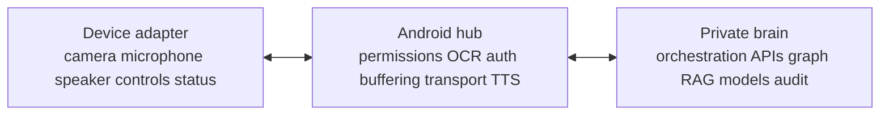

# Device–Hub–Brain Architecture

<!-- wiki-status: audience=developer; applies_to=rokid-ai-glasses-style-non-display; evidence=planned; last_reviewed=2026-07-30 -->

## Page status

| Field | Value |
|---|---|
| Audience | Developer |
| Applies to | Rokid AI Glasses Style (non-display) |
| Evidence status | Planned |
| Last reviewed | 2026-07-30 |

## Device

The device adapter exposes only qualified capabilities:

- connect and disconnect;
- capture still image;
- start and stop microphone;
- play and stop audio;
- receive controls and lifecycle events;
- report battery, firmware, and connection state.

## Hub

The Android phone owns user permissions, device session, local preprocessing,
identity, encryption, bounded buffering, backend routing, playback, and visible
failure state.

## Brain

The local/private backend performs structured queries, retrieval, policy,
model orchestration, evidence assembly, response generation, and immutable
audit. Models route and summarize retrieved evidence rather than inventing
facts from memory.

## Portability

A new glasses family should require a new device adapter, not a rewrite of the
hub or brain. Display, camera, audio, and control capabilities are optional
features negotiated by the adapter.
