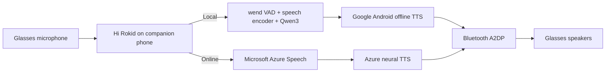

# Translation Architecture

## Summary

For the tested display-free Rokid AI Glasses and Hi Rokid
`G1.10.11.0713`, the glasses are the wearable audio endpoint and the
companion phone is the translation host and control plane.



## Local path

```text
glasses microphone
-> Bluetooth audio transport
-> Hi Rokid on companion phone
-> local wend speech and language stack
-> Android Google offline TTS
-> Bluetooth A2DP
-> glasses speakers
```

The target-language offline voice is a separate Android dependency.

## Online path

```text
glasses microphone
-> Bluetooth audio transport
-> Hi Rokid on companion phone
-> Microsoft Azure Speech recognition and translation
-> Azure neural TTS
-> Bluetooth A2DP
-> glasses speakers
```

## Confidence table

| Finding | Evidence level |
|---|---|
| Face-to-Face listens to glasses audio | Direct application-log evidence plus controlled source placement |
| Local model loads from phone application storage | Direct runtime and filesystem evidence |
| Local recognition/translation works without internet | Controlled offline execution |
| Local TTS uses Android Google speech engine | Direct Android/application logs |
| Online translation uses Azure Speech | Direct service endpoints and application logs |
| Both modes return audio through Bluetooth A2DP | Direct Android audio-routing evidence |
| ChatGPT/Gemini selector does not alter tested translation path | Repeated controlled comparison |
| Exact upstream checkpoint for audio encoder | Not established |
| Every region/version uses Azure | Not established |

## Design implication

A replacement or custom companion application would need to reproduce at
least four separate roles:

1. glasses connection and audio ingestion,
2. local or cloud speech processing,
3. translation result/session handling, and
4. output synthesis and Bluetooth audio routing.

The downloaded local package does not eliminate the Android TTS dependency.
