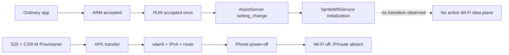

# Test 22 Independent Wi-Fi and Direct-Socket Boundary — Final Publication

## Accepted result

`PARTIAL_CAPABILITY_PHONE_CXRM_DEPENDENT_WIFI_NO_INDEPENDENT_ROUTE_PROVEN`

Test 22 distinguishes three separate questions that earlier stock-workflow captures could not separate:

1. whether the glasses contain a functional Wi-Fi data plane;
2. whether an ordinary sideloaded application can independently bring that data plane up;
3. whether a phone-established Wi-Fi session persists after the phone/CXR-M lifecycle ends.

The first is **proven yes**. The second is **not proven** for the tested ordinary-app AssistServer path. The third is **proven no** for the tested CXR-M-established session.

## Evidence-labeled result

| Claim | Evidence level | Result |
|---|---|---|
| Wi-Fi client hardware/driver/framework can associate and provision IP | Observed | Proven |
| CXR-M APK transfer can temporarily activate glasses `wlan0` | Observed | Proven |
| Ordinary app can send one accepted AssistServer Wi-Fi-setting request | Observed | Proven |
| AssistServer consumes the setting and enters Wi-Fi initialization | Observed | Proven |
| That ordinary-app request enables Android Wi-Fi within 15 s | Observed | No effect observed |
| CXR-M-established Wi-Fi remains after phone power-off | Observed | Disproven for tested session |
| Phone-off direct third-party socket | Not executed | Unresolved because prerequisite route disappeared |

## Control-path and data-plane split

## Accepted causal chain

The one-shot sender and AssistServer evidence correlate in the same second. The retained ARM/RUN receipt proves exactly one accepted targeted `setting_change` request for `settings_wifi_enable`. The retained receiver log proves AssistServer consumed the setting and entered its Wi-Fi service initialization path. The sender's bounded post-effect samples prove no Android Wi-Fi transition became visible during the observation window.

Separately, a live CXR-M APK-transfer reproduction activated Wi-Fi and produced `wlan0` IPv4/routing. Removing the phone immediately collapsed that session in five consecutive samples.

This establishes a platform lifecycle boundary without claiming a hardware limitation.

## Stopping rule

No further identical Wi-Fi-enable retries are warranted. The direct phone-off socket stage is also not warranted unless a future, separately justified mechanism first establishes an independently persistent routed `wlan0` session.

See the [full Test 22 record](../../../tests/test-22-independent-wifi-and-direct-socket.md) for repair-lineage provenance and interpretation limits.
