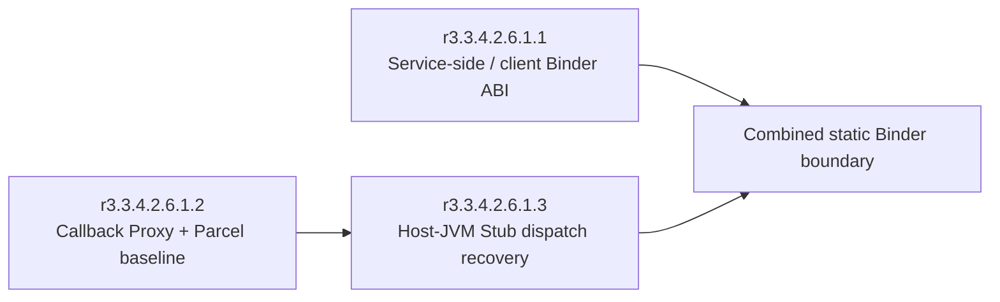
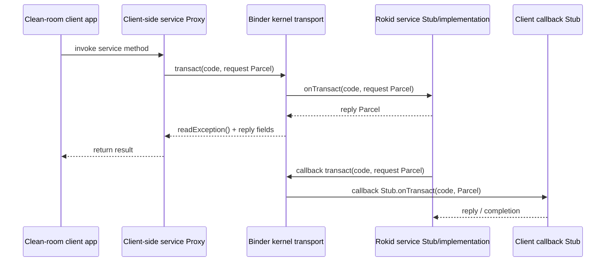
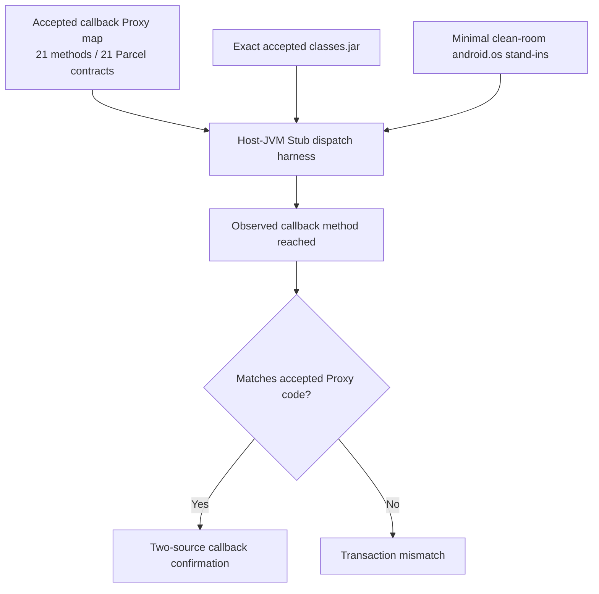
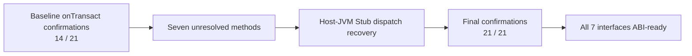
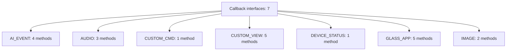

# Test 21 — Diagrams

## 1) High-level closure structure

**Interpretation:** `r3.3.4.2.6.1.1` closed the service-side/client ABI, while `r3.3.4.2.6.1.3` completed the callback side by closing the seven baseline Stub-confirmation gaps left by `r3.3.4.2.6.1.2`.

## 2) Client ↔ service ↔ callback flow

**Interpretation:** Test 21 describes the static structure of both directions: forward service calls and reverse callback calls.

## 3) Callback-side evidence pipeline

**Interpretation:** `r3.3.4.2.6.1.3` did not merely restate the Proxy map. It independently re-confirmed each callback transaction by executing the compiled Stub dispatch path on the host JVM.

## 4) Baseline gap and closure

**Interpretation:** The key improvement from baseline to final closure is the recovery of the seven unresolved callback Stub confirmations.

## 5) Final callback inventory

**Interpretation:** The final callback-side Binder ABI covers all seven callback interfaces and all twenty-one callback methods.
