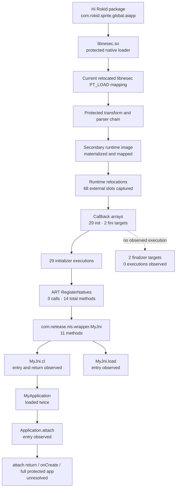

# Hi Rokid Protected Loader Architecture

## Scope

This document describes the best-supported protected startup architecture of
the global Hi Rokid Android companion application. It is limited to the loader,
runtime registration and Java handoff boundaries observed in the accepted
sanitized evidence.

## Control flow



## Architectural layers

### 1. Static package layer

The installed arm64 split contains `libnesec.so`. The accepted public source
identity is represented by SHA-256; the library itself is not published.

### 2. Native loader layer

Static analysis recovered a loader runtime object and the transform, parser,
mapping and callback machinery. Runtime analysis supplied the values that
static analysis could not establish safely:

- secondary mapping identity;
- external relocation values;
- exact post-transform snapshot identity;
- absolute callback execution at runtime.

### 3. Secondary runtime layer

The runtime loader produced a secondary mapped image and captured 68 external
relocation slots. Public documentation omits all absolute addresses and slot
values.

The callback array contained 29 initializer targets and two finalizer targets.
All 29 initializer callbacks executed in the captured startup. No finalizer
execution was observed.

### 4. Dynamic JNI layer

ART `RegisterNatives` was observed three times. Exact class attribution
separated 14 methods into:

```text
android.net.TrafficStats        2
com.netease.nis.wrapper.MyJni  11
dalvik.system.DexFile            1
```

The protected bootstrap class therefore has 11 proven registered methods, not
14.

### 5. Protected Java handoff

`MyJni.cl` entered and returned a class-loader object. `MyJni.load` subsequently
entered. The class-loader path loaded
`com.netease.nis.wrapper.MyApplication` twice, followed by entry into
`Application.attach`.

This establishes a protected Java handoff, but not completion through
`Application.onCreate`.

## Trust boundary

The protected loader is an implementation detail inside the first-party Hi
Rokid package. It is not a recommended dependency for a reusable smart-glasses
platform. Future clean-room work should identify stable device, media,
assistant, translation, account and firmware interfaces outside this
protection boundary.

<!-- BEGIN R23.5.1.7.1 TRIGGER OVERLAY -->
## Later startup-materialization and trigger overlay

A separate later evidence layer adds the following bounded sequence:

1. wrapper `MyApplication.attachBaseContext` reaches `MyJni.load`;
2. protected DEX/source accesses and class materialization are observed;
3. `MyJni.cl` participates in class-loader setup and returns;
4. baseline and Frida spawn/resume without an agent survive;
5. loading a zero-hook agent reaches messaging and is followed by death of the injected target in both tested modes.

The later diagram is
[`publication/loader-control-flow.mmd`](publication/loader-control-flow.mmd).
It supplements the original top-level native-runtime diagram rather than
replacing it. The exact detection predicate and exit primitive remain unresolved.
<!-- END R23.5.1.7.1 TRIGGER OVERLAY -->
