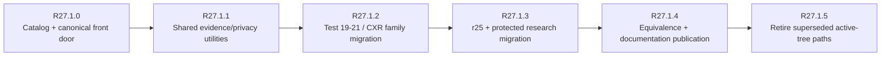

# R27.1.0 — Whole-Repository Research Harness Canonicalization

## Scope

R27.1.0 begins repository-wide tooling normalization across the **entire prior research history**, not only Test 21.

The covered scope includes:

- early launch/login/TLS/model-selection and connection tests;
- translation and visual/assistant research;
- Android lifecycle/background-service tests;
- glasses OS, ADB, and Developer Mode research;
- Tests 19–21 CXR research;
- r22–r24 protected companion/native-loader work;
- r25 connection-protocol work;
- boot-chain research;
- shared capture, analysis, sanitizer, evidence, and repository-safety tooling.

## R27.0 input findings

The whole-history census found a local worktree with hundreds of scripts and many revision families. The largest clusters included repeated test-tool contracts, source-contract checkers, Test 21 sanitized packagers, and r25 connection-protocol runners/validators.

R27.0 also preserved the local untracked research source before storage cleanup. Therefore R27.1 can normalize the active tree without treating the working-tree copy as the sole surviving historical source.

## What R27.1.0 changes

R27.1.0 adds:

- `scripts/rokid-research` as the canonical semantic front door;
- dynamic whole-worktree script/document cataloging;
- revision-family grouping;
- proposed canonical successor families;
- conservative execution/safety classifications;
- private lineage-report generation;
- canonical research-tooling documentation;
- repository documentation links that direct future contributors toward semantic tooling rather than revision-number discovery.

## What R27.1.0 deliberately does not change

- no historical script is deleted;
- no historical script is renamed;
- no revision implementation is automatically executed;
- no device action occurs;
- no private evidence is published;
- no claim of behavioral equivalence is made between different revisions merely because they share a family name.

## Migration sequence after R27.1.0

The later sequence may be adjusted after reviewing the generated private lineage inventory, but retirement remains the final step, not the first.

## Current stop gate

No new device testing should start while R27.1 canonicalization is incomplete. The existing accepted findings remain valid; this phase concerns repository maintainability and reproducibility, not reopening those results.
