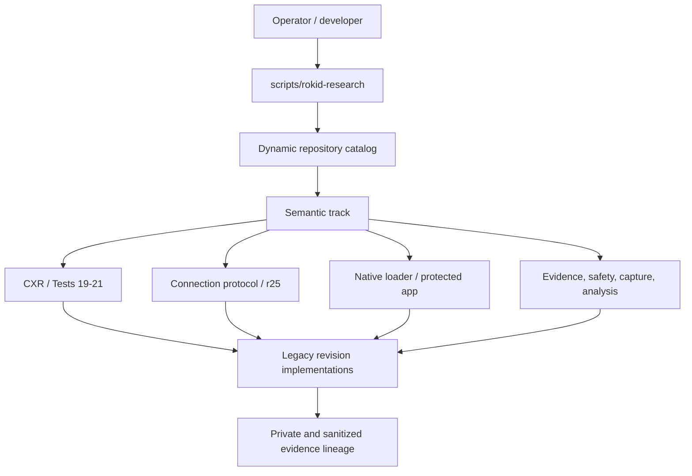

# Canonical Research Harness

## Goal

The long-term goal is to replace revision-number navigation with stable semantic commands while retaining exact historical lineage.

R27.1.0 establishes the bridge layer. It does **not** yet rewrite every historical implementation into shared modules.

## Architecture



The canonical front door currently performs discovery, classification, verification, and private inventory generation. Later R27 stages can migrate proven-equivalent families behind stable semantic commands without changing the user-facing interface.

## Commands

### Summary

```bash
scripts/rokid-research summary
```

Reports current script/document counts and major classifications.

### Catalog

```bash
scripts/rokid-research catalog
scripts/rokid-research catalog --track test21
scripts/rokid-research catalog --track r25-connection-protocol --operation run
```

The catalog reports:

- research track;
- operation type;
- Git status;
- conservative safety class;
- historical path;
- proposed semantic successor family.

### Resolve one historical script

```bash
scripts/rokid-research resolve scripts/tests/run_test21_r3_3_4_2_6_1_2_callback_abi.sh
```

This returns the exact path hash, family, safety classification, and proposed semantic successor.

### Verify canonical layer

```bash
scripts/rokid-research verify
```

The verifier ensures the canonical layer is installed and major historical tracks remain visible. It intentionally does not claim functional equivalence between revision families; those migrations require later R27 equivalence gates.

### Generate private whole-worktree lineage

```bash
scripts/rokid-research inventory --output "$HOME/Downloads/rokid-r27-1-0-lineage"
```

This writes a full script/document lineage report and packages it as a private ZIP. Because local untracked research paths may be included, the generated lineage ZIP is **not a public GitHub artifact by default**.

## Stable semantic families

R27.1.0 assigns every historical script to a proposed stable family such as:

```text
rokid-research cxr <operation>
rokid-research connection <operation>
rokid-research native-loader <operation>
rokid-research protected-application <operation>
rokid-research capture <operation>
rokid-research analysis <operation>
rokid-research evidence <operation>
rokid-research repo <operation>
```

These are taxonomy targets in R27.1.0. Historical implementations remain the source of truth until a later migration proves equivalence.

## R27.1.1 first migrated family: r25 package validation

R27.1.1 moves the repeated **installed-package validation logic** for twelve r25 connection-protocol revisions behind one data-driven engine. Historical validators remain present as provenance and as the independent equivalence oracle during this stage.

Canonical use:

```bash
scripts/rokid-research connection validate --list
scripts/rokid-research connection validate --revision r25.2.4
scripts/rokid-research connection validate --revision r25.3.1.3
```

The canonical validator supports the validation primitives repeatedly implemented by the historical shell scripts:

- required-file presence and optional nonempty/no-symlink gates;
- in-memory Python syntax compilation;
- `bash -n` syntax checks;
- SHA-256 prerequisite locks;
- required semantic markers;
- forbidden-pattern safety gates;
- preserved historical PASS markers.

The validator does **not** execute device commands, collectors, or r25 experiments. It only validates installed repository content.

### Migration state

```text
r25 package validators represented by canonical profiles: 12
historical validator deletion: NONE
historical validator rewrite: NONE
canonical/legacy equivalence required: 12/12
```

The legacy validator files may only be considered for retirement in a later R27 stage after the canonical validator has passed equivalence on the actual repository and the revision lineage archive remains intact.

<!-- r27.1.2-evidence-packaging -->
## R27.1.2 migrated family: Test 21 sanitized-evidence packaging

R27.1.2 moves the repeated Test 21 sanitized packaging mechanics behind one shared, data-driven engine. Thirty historical packagers are represented, including the final accepted `r3.3.4.2.6.1.3` privacy-gated packager.

Canonical use:

```bash
scripts/rokid-research evidence package --list
scripts/rokid-research evidence package --revision r3.3.4.2.6.1.2 --evidence /path/to/evidence
scripts/rokid-research evidence package --revision r3.3.4.2.6.1.3 --evidence /path/to/evidence
```

The shared engine owns:

- SHA-256 file hashing and sidecars;
- internal manifest generation and verification;
- deterministic ZIP construction;
- required, fixed, exact, and all-file member-set policies;
- historical filename/privacy policies where they existed;
- the final current privacy policy, including user-home, email, MAC, bearer/JWT, phone-serial, forbidden-file-type, and standalone IPv4 detection;
- dotted numeric revision strings such as `r3.3.4.2.6.1.3` are explicitly not treated as IPv4 addresses.

Revision-specific file names, manifest names, legacy source hashes, and privacy policy selection live in `profiles/test21-sanitized-packagers.json` rather than duplicated Python implementations.

Canonical ZIP metadata is deterministic, so the container SHA-256 is not required to match a historical ZIP byte-for-byte. Equivalence is defined by packaged member names and bytes, valid sidecars, required PASS markers, source locks, and negative missing-member gates.

Historical packager deletion remains **NONE** in R27.1.2.

<!-- r27.1.3-source-contracts -->
## R27.1.3 migrated family: Test 21 source-contract dispatch

R27.1.3 adds a single canonical source-contract command for the currently applicable Test 21 source-contract checker family.

Canonical use:

```bash
scripts/rokid-research contract check --list
scripts/rokid-research contract check --track test21 --revision r3.3.4.1
scripts/rokid-research contract check --track test21 --revision r3.3.4.2.6.1.2
```

The current repository contains 32 historical `check_*_source_contract.py` files. Twenty-nine belong to Test 21 and remain applicable to the current source tree. Three Test 20 contracts are retained as explicit deferred historical contracts because they do not form a clean current-tree equivalence set: one targets a superseded application-version marker and another requires an output artifact.

R27.1.3 does not rewrite those historical contract implementations. Instead it introduces a source-locked canonical dispatch/profile layer and requires exact return-code/stdout equivalence for all 29 currently applicable Test 21 contracts. This establishes a stable semantic interface without falsely claiming that the historical predicate logic has already been reduced to one implementation.

Migration state:

```text
current historical source-contract checker files: 32
Test 21 canonical-dispatch profiles: 29
Test 20 deferred historical contracts: 3
historical checker deletion: NONE
historical checker rewrite: NONE
```

The next source-contract consolidation stage may extract repeated predicates into shared primitives only after the dispatch equivalence matrix has passed on the actual repository.

<!-- r27.1.4-tool-tests -->
## R27.1.4 migrated family: historical tool-test invocation

R27.1.4 adds a source-locked registry and stable command for the Tests 19–21 `test_*_tools.py` suites:

```bash
scripts/rokid-research test run --list
scripts/rokid-research test run --track test20 --revision r3.3
scripts/rokid-research test run --track test21 --revision r3.3.4.2.6.1.3
```

The current tree contains 39 historical tool-test suites. Thirty-eight are current-tree equivalents behind canonical dispatch. One Test 21 suite (`r3.3.4.2.6.1.1`) is retained as `DEFERRED_MISSING_FIXTURE` because its synthetic obfuscated AAR fixture is absent.

This stage consolidates **invocation, classification, source locking, and equivalence reporting**. It does not rewrite individual historical assertions or delete the historical unittest files.

<!-- r27.1.5-shared-primitives -->
## R27.1.5 shared primitives and retirement readiness

R27.1.5 extracts duplicated host-only implementation primitives from the canonical validator, evidence packager, source-contract dispatcher, test runner, and catalog into `primitives.py` and `privacy.py`.

It also adds a mechanical retirement boundary:

```bash
scripts/rokid-research retirement status
```

The gate distinguishes independent canonical implementations from commands that still execute historical oracles. At this stage, 12 r25 validators and 30 Test 21 packagers are retirement candidates; source-contract checkers and tool-test suites remain required historical oracles. **No historical file is deleted in R27.1.5.**

See [R27.1.5 shared primitives and retirement readiness](../r27.1.5-shared-primitives-retirement-readiness.md).

<!-- r27.1.11-source-contract-snapshot -->
## R27.1.11 source-contract implementation convergence

The `contract check` interface no longer dispatches to the 29 historical Test 21 checker implementations. Each active profile now declares:

- the archived historical oracle SHA-256;
- the live compatibility-shim SHA-256;
- the exact accepted source-file SHA-256 closure;
- required repository directories where applicable;
- explicit dependencies on earlier canonical source-contract profiles; and
- the historical success stdout required for compatibility callers.

The canonical engine evaluates those predicates directly. Historical checker paths are retained only as compatibility shims for runners and tests that still invoke the old filenames.

Current state after R27.1.11:

```text
Test 21 source-contract profiles: 29
independent canonical source-contract engine: YES
historical checker implementations active: 0
historical checker compatibility shims: 29
accepted source-file references: 288
contract-lineage edges: 27
repository path deletion: NONE
```

Three Test 20 contracts remain deferred historical contracts and are not rewritten by this phase.

<!-- r27.1.12-tool-test-oracles -->
## R27.1.12 preserved regression-oracle boundary

The remaining 38 current Tests 19–21 tool-test suites are intentionally **not** converted into a single declarative test implementation. They include independent Java compilation, ZIP/network fixtures, fake Frida modules, subprocess contracts, and source-safety assertions. Collapsing those tests into the same implementation they validate would reduce independence rather than reduce risk.

R27.1.12 therefore finalizes them as source-locked regression oracles:

```bash
scripts/rokid-research test verify-oracles
scripts/rokid-research test run --list
```

Final R27.1 retirement state:

```text
retired compatibility shims: 71
preserved current regression oracles: 38
preserved historical/deferred entries: 4
not-retirement-ready entries: 0
retirement candidates: 0
blocked source locks: 0
repository path deletion: NONE
```

The current 38 suites remain independently executable and must continue to pass through the canonical runner with their registered test counts.


## R27.2.1 connection finalization and publication verification

The connection-protocol canonical surface now includes host-only finalization and sanitized-publication verification:

```bash
scripts/rokid-research connection finalize --list
scripts/rokid-research connection finalize --revision r25.2.2.2 --run /path/to/run

scripts/rokid-research connection verify-publication --list
scripts/rokid-research connection verify-publication --revision r25.2.2.2 --publication /path/to/publication.json
```

The finalizer engine preserves each revision's manifest structure, selected evidence set, archive naming, ZIP metadata policy, and historical success markers. The publication engine directly evaluates the revision's privacy and semantic predicates and does not dispatch to the historical verifier implementation. R27.2.1 keeps all thirteen historical paths byte-unchanged pending a later retirement gate.

<!-- r27.2.2-r25-finalization-publication-reduction -->
## R27.2.2 r25 lifecycle compatibility boundary

The seven historical r25 finalizer entry points and six publication-verifier entry points are compatibility shims. Original bytes are preserved privately before replacement and remain the retirement-equivalence oracle.

Current state:

```text
r25 finalizer compatibility shims: 7
r25 publication-verifier compatibility shims: 6
R27.2.2 newly canonicalized implementations: 13
cumulative R27 canonicalized implementations: 84
historical path deletion: NONE
```

Historical runners may continue to invoke the revision-specific filenames; those files now delegate to the canonical profile-driven engines.

<!-- r27.2.4-test21-pcap-parser -->
## R27.2.4 Test 21 PCAP parser surface

The canonical harness exposes the duplicated r3.3.3/r3.3.3.1 host-side PCAP parsing architecture through one revision-profiled command:

```bash
scripts/rokid-research network parse-pcap --list
scripts/rokid-research network parse-pcap --revision r3.3.3 --pcap /path/to/capture.pcap --uid-map /path/to/uid-map.json --output /path/to/private-output
```

R27.2.4 is an equivalence gate only. The two untracked historical parser implementations remain exact-hash behavioral oracles. Successful equivalence requires identical stdout and private output bytes on synthetic Ethernet/short-header fixtures; r3.3.3.1 additionally exercises raw-IP linktype 101. Unsupported PCAP magic must be rejected by both implementations.

See [R27.2.4 parser framework](../r27.2.4-test21-pcap-parser-framework.md).

- [R27.2.5 Test 21 PCAP parser reduction](../r27.2.5-test21-pcap-parser-reduction.md)

<!-- r27.2.7-test19-network-analyzer -->
## R27.2.7 Test 19 network-privacy analyzer surface

The canonical harness exposes the Test 19 r1/r2 PCAPdroid CSV privacy analyzers through one profile-driven host-only command:

```bash
scripts/rokid-research network analyze-csv --list
scripts/rokid-research network analyze-csv --revision test19-r2 --csv /path/to/export.csv --output /path/to/result.json
```

R27.2.7 is an equivalence gate only. The two tracked historical analyzers remain exact-hash behavioral oracles. The gate preserves r1 `PASS/FAIL` and r2 `PASS/FAIL/BLOCKED` semantics, including the rule that stock Hi Rokid public traffic is reported separately and does not count as custom-app public traffic.

See [R27.2.7 network analyzer framework](../r27.2.7-test19-network-analyzer-framework.md).

## Whole-history closure gate

R27.2.8 adds `rokid-research consolidation status`. This is a closure/disposition gate, not a claim that every historical script should share one implementation. It verifies 88 canonicalized implementations, preservation counts, exact locks for four semantically distinct residual families, and zero remaining host-only multi-member consolidation candidates selected for migration.
