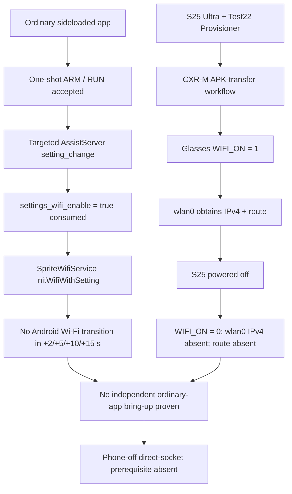

# Test 22 — Independent On-Glasses Wi-Fi, Routed IP, and Third-Party Direct Socket Capability

<!-- wiki-status: audience=developer,research; applies_to=rokid-ai-glasses-style-non-display; evidence=validated; last_reviewed=2026-08-05 -->

## Final status

`TEST22_FINAL_STATUS=PARTIAL_CAPABILITY_PHONE_CXRM_DEPENDENT_WIFI_NO_INDEPENDENT_ROUTE_PROVEN`

Test 22 is closed. The tested Rokid AI Glasses Style have a functional Android Wi-Fi client stack, and CXR-M can temporarily bring up `wlan0`, obtain IPv4, and install a route during the phone-driven transfer workflow. The resulting Wi-Fi session did not persist when the Samsung Galaxy S25 Ultra that established the CXR-M session was powered off.

A separately governed ordinary sideloaded application also reached Rokid's AssistServer Wi-Fi setting consumer with exactly one accepted one-shot command. AssistServer processed `settings_wifi_enable=true` and entered the `SpriteWifiService` Wi-Fi initialization path, but Android Wi-Fi did not become enabled and no active Wi-Fi transport appeared in the bounded +2/+5/+10/+15 second observation window.

The planned phone-off third-party direct-socket experiment was therefore **not executed**: its prerequisite, an independently persistent routed `wlan0` data plane, disappeared when the phone was removed. This is an explicit untested boundary, not a socket failure.

## Capability result

| Boundary | Final result |
|---|---|
| Physical/Android Wi-Fi client capability | **Proven** |
| `wlan0` association and IPv4 provisioning during CXR-M transfer | **Proven** |
| CXR-M temporary routed Wi-Fi session | **Proven** |
| Ordinary sideloaded app ARM accepted | **Proven** |
| Ordinary sideloaded app RUN accepted | **Proven** |
| Exactly one targeted AssistServer Wi-Fi-setting broadcast | **Proven** |
| AssistServer consumed `settings_wifi_enable=true` | **Proven** |
| `SpriteWifiService` Wi-Fi initialization path reached | **Proven** |
| Android Wi-Fi transition from that ordinary-app request | **Not observed** |
| Independent routed Wi-Fi after phone power-off | **Disproven for the tested CXR-M-established session** |
| Phone-off third-party direct socket | **Not tested because prerequisite route disappeared** |
| General impossibility of all privileged/custom-firmware Wi-Fi methods | **Not claimed** |

## Final architecture finding



## Evidence chain

### 1. Stock-workflow baseline

Earlier passive tests found no glasses-side Wi-Fi interface or route during the qualified stock voice and visual-AI workflows. Those results established that the phone was the observed public-network gateway for those workflows; they did not prove that the glasses lacked Wi-Fi capability.

### 2. CXR-M demonstrated real Wi-Fi capability

Retained Android framework evidence and the final live reproduction both demonstrated that the glasses can operate `wlan0` as a primary client, associate, complete Wi-Fi authentication, and complete IP provisioning. In the final reproduction on 2026-08-05, the glasses changed from `WIFI_ON=0` to `WIFI_ON=1` during the actual Test22 Provisioner CXR-M APK-transfer action; approximately two seconds later the read-only monitor observed IPv4 and a `wlan0` route.

This closes the hardware/driver/Android-stack capability question: the non-display glasses are not inherently Bluetooth-only.

### 3. Ordinary-app one-shot control request was real

The retained Test 22 one-shot receipts prove:

- ARM: `ok=true`, `armed=true`, `expires_in_ms=60000`;
- RUN: `ok=true`, `accepted=true`, `broadcast_count=1`;
- action: `com.rokid.os.master.assist.server.cmd`;
- target: `com.rokid.os.sprite.assistserver`;
- command type: `setting_change`;
- setting key: `settings_wifi_enable`.

The sender recorded the targeted broadcast at 2026-08-04 10:35:22.708 EDT. Retained AssistServer logging in the same second showed the Wi-Fi-setting path consuming `settings_wifi_enable=true`, changing the stored setting from false to true, and entering `SpriteWifiService -> initWifiWithSetting`.

### 4. Control-path success did not become a data-plane effect

The one-shot sender sampled at +2, +5, +10, and +15 seconds. Every sample reported Wi-Fi disabled and no active Wi-Fi transport. The final sender classification was `NO_WIFI_ENABLE_EFFECT_OBSERVED`.

The correct interpretation is therefore **control-path effect proven, usable Wi-Fi data-plane effect not proven**. It is not correct to say that the command was never delivered.

### 5. Repair-lineage forensics closed false control-path hypotheses

The r4.3.6.3.6 repair sequence was used to prevent a false negative from ambiguous ActivityManager/Activity lifecycle behavior:

| Repair | Closure |
|---|---|
| 6.9.1 | Historical Stage-B delivery occurred, but retained ARMED state and no Wi-Fi effect could not by themselves prove RUN consumption. |
| 6.9.2.1 | Existing-top `onNewIntent()` convergence to `applyPhaseFromIntent` confirmed; missing-`onNewIntent` hypothesis rejected. |
| 6.9.3 | Consumer truth table recovered; only null Intent and null/blank phase were rejecting gates. |
| 6.9.4 | All four predicates modeled; no one-shot rejection existed in `applyPhaseFromIntent`. |
| 6.9.5 | Intended sender ABI recovered as String extra `phase=RUN`; stale-`getIntent()` hypothesis closed. |
| 6.9.6 | Exact historical command-to-ActivityManager execution edge was unrecoverable from retained evidence; historical reconstruction stopped. |
| 6.9.7 | `applyPhaseFromIntent("RUN")` was separated from actual one-shot execution ownership. |
| Final controlled execution / Repair 2 | Exact ARM/RUN ABI, durable one-shot guard, no automatic retry, and final execution contract validated. |
| Receipt recovery | Existing ARM and RUN receipts proved the actual one-shot accepted exactly one AssistServer Wi-Fi-setting broadcast. |

The repair lineage is provenance. It is not a requirement for future users to replay those revisions.

### 6. Phone-removal isolation closed the independence question

During the final CXR-M reproduction the read-only monitor observed:

1. `WIFI_ON=0`, no `wlan0` IPv4, no route;
2. during the actual APK-transfer path, `WIFI_ON=1`;
3. shortly afterward, `wlan0` IPv4 and a route were present;
4. the S25 Ultra was then completely powered off;
5. five consecutive post-removal samples showed `WIFI_ON=0`, no `wlan0` IPv4, and no `wlan0` default route.

The tested CXR-M-established data plane is therefore lifecycle-coupled to the active phone/CXR-M workflow and is not an independently persistent Wi-Fi route.

## Why the direct-socket stage was not run

The Stage-C direct-socket tool was designed to bind an ordinary Android application socket explicitly to an existing Wi-Fi `Network` and connect to a controlled backend without ADB forwarding/reverse. Once phone removal tore down Wi-Fi, that prerequisite no longer existed. Running the socket test afterward would only prove the absence of a route already established by the isolation samples, so it was intentionally not executed.

A narrower future experiment could test whether an ordinary application can use the temporary CXR-M Wi-Fi network *while the phone session remains active*. That question does not alter the closed Test 22 result about phone-independent operation.

## Final interpretation boundary

Test 22 supports this statement:

> On the tested Rokid AI Glasses Style firmware and ordinary non-privileged application boundary, Wi-Fi hardware and Android networking are functional, but the discovered ordinary-app AssistServer Wi-Fi-setting path did not bring up a usable data plane, and the CXR-M-established routed Wi-Fi session was torn down when the phone was powered off. An independently persistent phone-free routed Wi-Fi path was therefore not proven.

Test 22 does **not** claim:

- that the Wi-Fi hardware is disabled or unusable;
- that a privileged/system-signed application could not maintain Wi-Fi;
- that custom firmware could not change the lifecycle;
- that all possible third-party socket use is blocked;
- that the temporary CXR-M Wi-Fi network cannot carry ordinary-app traffic while the phone remains active.

## Public/private evidence boundary

The public tree contains only sanitized conclusions, state transitions, timestamps at second-level where useful, schemas, and artifact hashes. Do not publish raw device serials, SSIDs, BSSIDs, Bluetooth addresses, IP addresses, tokens/nonces, APK binaries, raw logcat/dumpsys output, PCAPs, or private evidence archives.

## Retained qualification implementation

The final publication retains the source-only `android-client/test22/` module and the branch-local Test 22 build/source-contract/analyzer helpers that produced the qualification evidence. Generated Gradle output (`android-client/test22/build/`) and Python bytecode caches are excluded.

These lower-level files are retained for reproducibility and implementation history; they are **not** the canonical operator interface. New read-only diagnostic work should start with `scripts/tests/test22`.

## Reproducible public tooling

Use the consolidated read-only Test 22 tool:

```text
scripts/tests/test22 device-status
scripts/tests/test22 monitor
scripts/tests/test22 isolation
scripts/tests/test22 receipts --root /path/to/private/test22-output
scripts/tests/test22 effect --root /path/to/private/test22-output
scripts/tests/test22 compact --input /path/to/full-log.txt
```

The tool deliberately contains no Wi-Fi enable command, no AssistServer sender, no captured-payload replay, no ADB forward/reverse tunnel, and no automatic effect retry.

## Related publication

- [Developer networking boundary](../developer/companion-app/test22-networking-boundary.md)
- [Sanitized research publication](../research/connection-protocol/publication/test22-independent-wifi-boundary.md)
- [Machine-readable evidence chain](../research/connection-protocol/publication/test22-evidence-chain.json)
